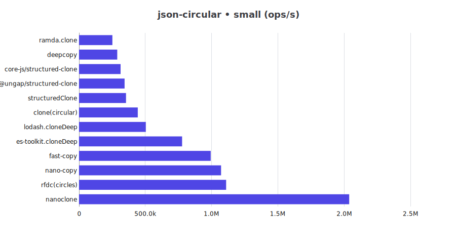
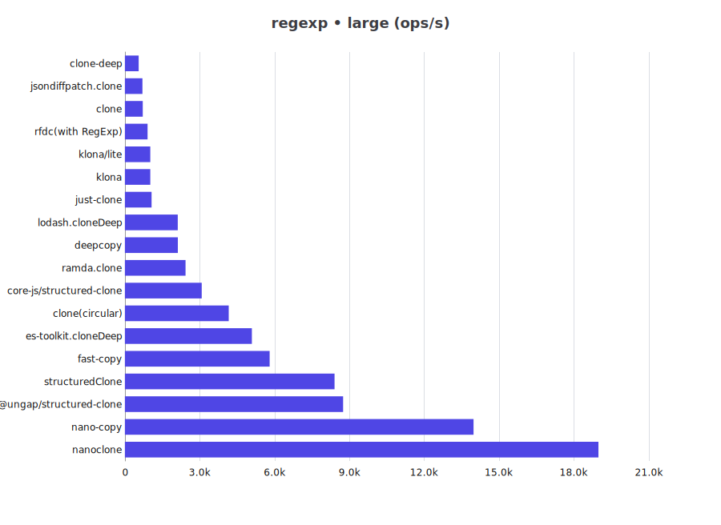
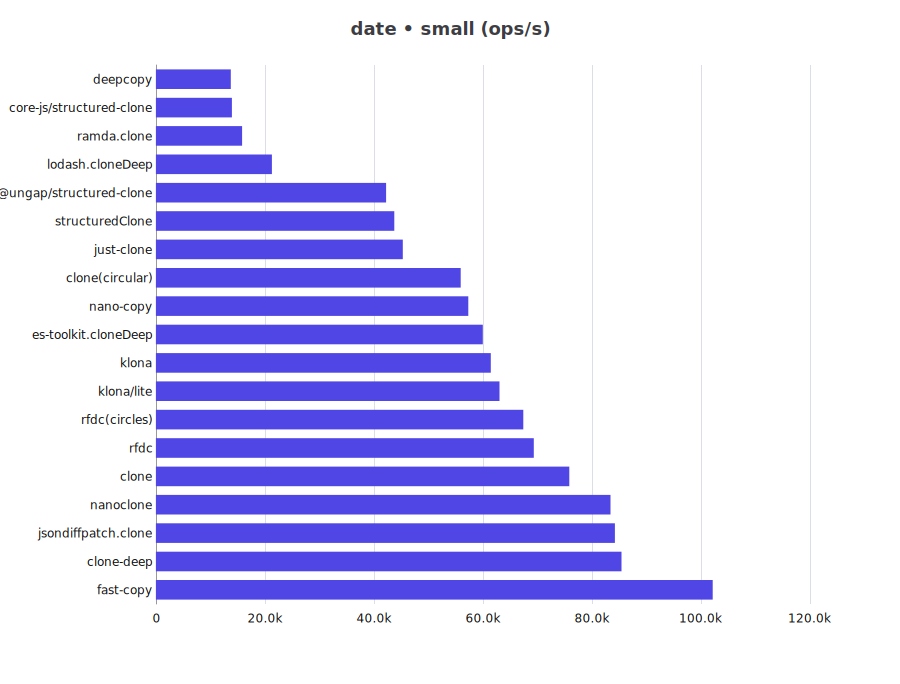
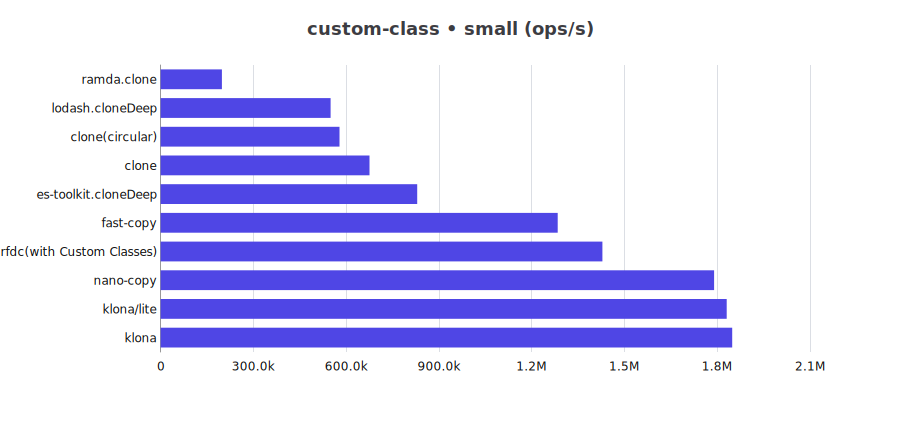
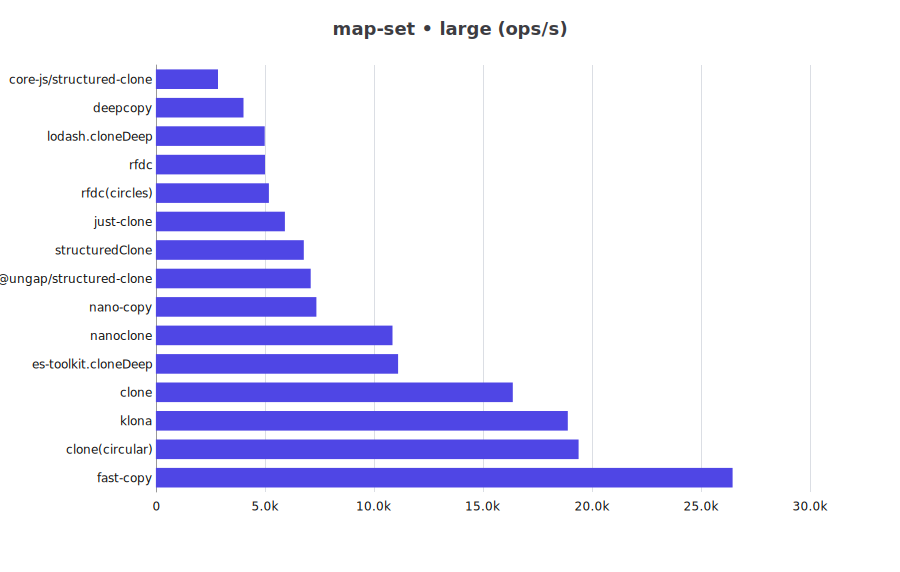

# JS Deep Clone Benchmark for Bun

This is a benchmark for JS deep clone libraries for Bun.

## Benchmark Results

for Node please refer to [Node](README.md)

cpu: 13th Gen Intel(R) Core(TM) i5-13400F

runtime: bun 1.2.21 (x64-win32)

### json

| Library | small (ops/s) | large (ops/s) |
| -- | --: | --: |
| @ungap/structured-clone | 28,978 | 2,857 |
| clone | 32,096 | 379 |
| clone-deep | 165,814 | 864 |
| clone(circular) | 28,645 | 3,362 |
| copy-anything | 45,240 | 468 |
| core-js/structured-clone | 12,090 | 1,529 |
| deepcopy | 12,416 | 1,255 |
| es-toolkit.cloneDeep | 55,631 | 5,183 |
| fast-copy | 169,743 | 12,254 |
| fastest-json-copy | 295,523 | 1,540 |
| JSON.stringify/parse | 41,296 | 773 |
| just-clone | 21,425 | 376 |
| klona | 69,270 | 1,107 |
| klona/json | 72,015 | 1,224 |
| klona/lite | 67,176 | 1,139 |
| lodash.cloneDeep | 20,963 | 1,899 |
| nano-copy | 59,219 | 5,183 |
| nanoclone | 73,173 | 8,768 |
| plain-object-clone | 28,738 | 458 |
| ramda.clone | 9,077 | 629 |
| rfdc | 36,170 | 622 |
| rfdc(circles) | 35,866 | 587 |
| structuredClone | 28,976 | 2,966 |

### json-circular

| Library | small (ops/s) | large (ops/s) |
| -- | --: | --: |
| @ungap/structured-clone | 381,515 | 570 |
| clone(circular) | 846,355 | 263 |
| core-js/structured-clone | 324,764 | 243 |
| deepcopy | 391,700 | 270 |
| es-toolkit.cloneDeep | 1,541,208 | 1,059 |
| fast-copy | 3,334,660 | 2,797 |
| lodash.cloneDeep | 907,826 | 565 |
| nano-copy | 2,761,832 | 2,656 |
| nanoclone | 2,940,552 | 1,868 |
| ramda.clone | 267,324 | 54 |
| rfdc(circles) | 3,053,795 | 1,102 |
| structuredClone | 366,558 | 574 |

### regexp

| Library | small (ops/s) | large (ops/s) |
| -- | --: | --: |
| @ungap/structured-clone | 61,411 | 9,213 |
| clone | 47,831 | 705 |
| clone-deep | 46,096 | 595 |
| clone(circular) | 44,471 | 4,228 |
| core-js/structured-clone | 29,203 | 3,157 |
| deepcopy | 20,870 | 2,241 |
| es-toolkit.cloneDeep | 54,066 | 5,474 |
| fast-copy | 54,584 | 6,049 |
| just-clone | 76,458 | 1,145 |
| klona | 77,089 | 1,024 |
| klona/lite | 76,272 | 1,135 |
| lodash.cloneDeep | 25,997 | 2,137 |
| nano-copy | 160,396 | 15,372 |
| nanoclone | 230,728 | 19,197 |
| ramda.clone | 27,269 | 2,489 |
| rfdc(with RegExp) | 68,177 | 1,012 |
| structuredClone | 59,224 | 9,346 |

### date

| Library | small (ops/s) | large (ops/s) |
| -- | --: | --: |
| @ungap/structured-clone | 45,239 | 15,528 |
| clone | 32,363 | 569 |
| clone-deep | 51,327 | 941 |
| clone(circular) | 29,816 | 5,191 |
| core-js/structured-clone | 13,923 | 2,299 |
| deepcopy | 14,193 | 3,088 |
| es-toolkit.cloneDeep | 38,784 | 14,512 |
| fast-copy | 46,183 | 12,710 |
| just-clone | 45,218 | 835 |
| klona | 65,162 | 1,281 |
| klona/lite | 66,123 | 1,229 |
| lodash.cloneDeep | 22,662 | 4,161 |
| nano-copy | 60,838 | 19,705 |
| nanoclone | 86,673 | 23,141 |
| ramda.clone | 16,827 | 3,448 |
| rfdc | 72,544 | 1,317 |
| rfdc(circles) | 74,042 | 1,308 |
| structuredClone | 45,700 | 15,713 |

### custom-class

| Library | small (ops/s) | large (ops/s) |
| -- | --: | --: |
| clone | 372,886 | 1,116 |
| clone(circular) | 333,922 | 806 |
| es-toolkit.cloneDeep | 496,764 | 1,324 |
| fast-copy | 490,660 | 1,691 |
| klona | 743,160 | 2,476 |
| klona/lite | 779,958 | 2,377 |
| lodash.cloneDeep | 353,721 | 999 |
| nano-copy | 791,666 | 2,601 |
| ramda.clone | 203,510 | 337 |
| rfdc(with Custom Classes) | 1,367,559 | 3,696 |

### array-buffer

| Library | small (ops/s) | large (ops/s) |
| -- | --: | --: |
| @ungap/structured-clone | 18,437 | 7 |
| core-js/structured-clone | 30,060 | 29 |
| es-toolkit.cloneDeep | 30,247 | 20 |
| fast-copy | 29,044 | 29 |
| klona | 28,342 | 29 |
| nano-copy | 31,002 | 30 |
| rfdc(with ArrayBuffer) | 28,201 | 29 |
| structuredClone | 18,724 | 7 |

### buffer

| Library | small (ops/s) | large (ops/s) |
| -- | --: | --: |
| clone | 121,544 | 33 |
| clone(circular) | 119,821 | 33 |
| deepcopy | 44,386 | 16 |
| klona | 126,630 | 34 |
| nano-copy | 121,550 | 32 |
| rfdc | 123,939 | 32 |
| rfdc(circles) | 131,830 | 34 |

### buffer-zero-copy

| Library | small (ops/s) | large (ops/s) |
| -- | --: | --: |
| es-toolkit.cloneDeep | 707,892 | 641,950 |
| lodash.cloneDeep | 478,717 | 531,045 |

### map-set

| Library | small (ops/s) | large (ops/s) |
| -- | --: | --: |
| @ungap/structured-clone | 63,390 | 7,100 |
| clone | 206,610 | 28,272 |
| clone(circular) | 156,873 | 20,972 |
| core-js/structured-clone | 35,610 | 3,120 |
| deepcopy | 39,233 | 4,094 |
| es-toolkit.cloneDeep | 82,229 | 13,988 |
| fast-copy | 203,767 | 28,863 |
| just-clone | 68,827 | 6,970 |
| klona | 150,214 | 20,295 |
| lodash.cloneDeep | 67,767 | 5,373 |
| nano-copy | 52,091 | 8,167 |
| nanoclone | 91,022 | 16,111 |
| rfdc | 55,181 | 5,176 |
| rfdc(circles) | 56,751 | 5,371 |
| structuredClone | 65,532 | 7,276 |

