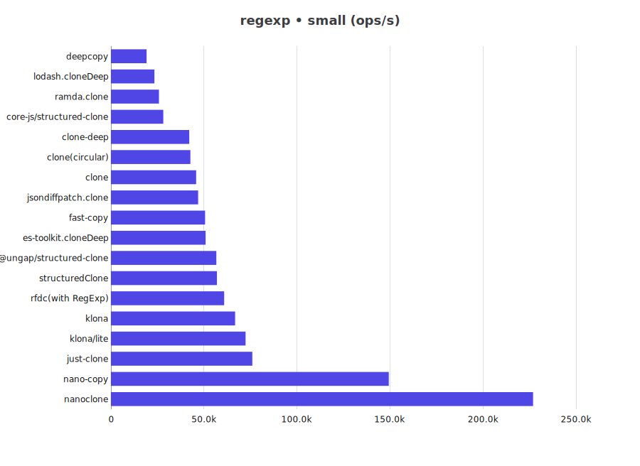
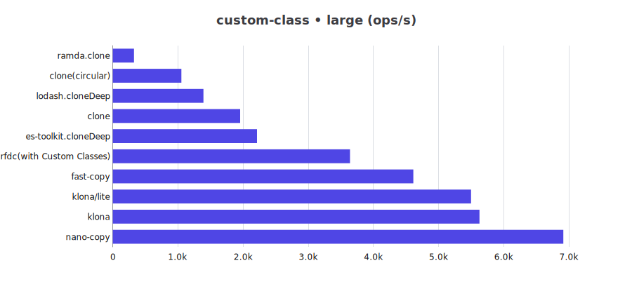
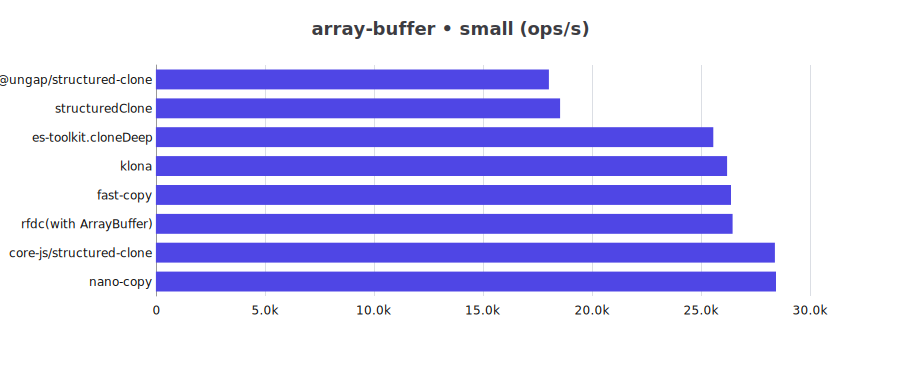
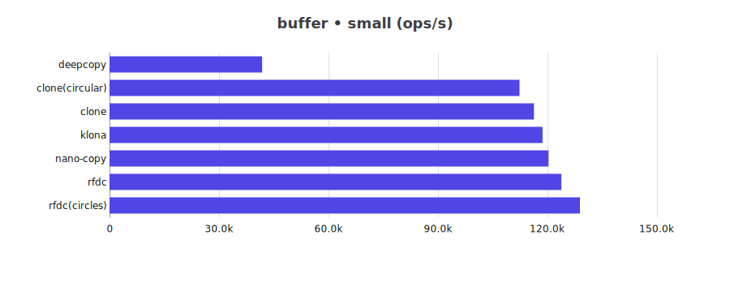
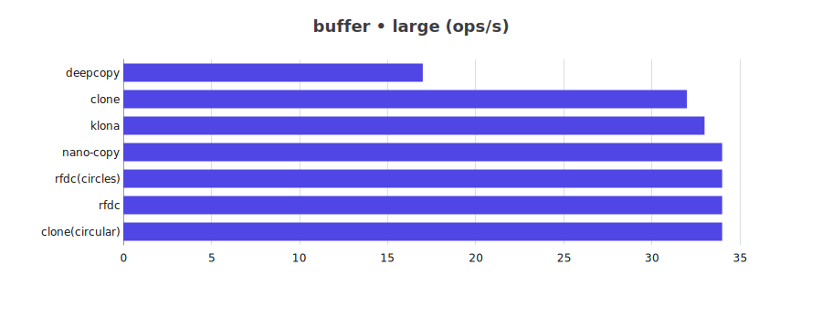

# JS Deep Clone Benchmark for Bun

This is a benchmark for JS deep clone libraries for Bun.

## Benchmark Results

for Node please refer to [Node](README.md)

cpu: 13th Gen Intel(R) Core(TM) i5-13400F

runtime: bun 1.2.23 (x64-win32)

### json

| Library | small (ops/s) | large (ops/s) |
| -- | --: | --: |
| @ungap/structured-clone | 27,925 | 2,700 |
| clone | 30,606 | 297 |
| clone-deep | 160,164 | 786 |
| clone(circular) | 27,283 | 1,813 |
| copy-anything | 41,794 | 398 |
| core-js/structured-clone | 11,803 | 1,556 |
| deepcopy | 11,966 | 1,007 |
| es-toolkit.cloneDeep | 52,606 | 2,735 |
| fast-copy | 159,041 | 3,729 |
| fastest-json-copy | 290,261 | 1,352 |
| JSON.stringify/parse | 40,229 | 726 |
| jsondiffpatch.clone | 66,671 | 1,132 |
| just-clone | 20,320 | 346 |
| klona | 61,188 | 1,022 |
| klona/json | 68,426 | 1,143 |
| klona/lite | 64,102 | 1,035 |
| lodash.cloneDeep | 19,394 | 1,878 |
| nano-copy | 51,124 | 4,770 |
| nanoclone | 73,945 | 8,145 |
| plain-object-clone | 27,589 | 459 |
| ramda.clone | 8,345 | 606 |
| rfdc | 34,078 | 574 |
| rfdc(circles) | 33,514 | 588 |
| structuredClone | 27,945 | 2,834 |

### json-circular

| Library | small (ops/s) | large (ops/s) |
| -- | --: | --: |
| @ungap/structured-clone | 356,688 | 594 |
| clone(circular) | 444,667 | 232 |
| core-js/structured-clone | 328,409 | 229 |
| deepcopy | 299,121 | 251 |
| es-toolkit.cloneDeep | 750,628 | 1,058 |
| fast-copy | 954,822 | 2,637 |
| lodash.cloneDeep | 522,205 | 521 |
| nano-copy | 1,086,204 | 2,300 |
| nanoclone | 2,028,367 | 1,804 |
| ramda.clone | 245,506 | 55 |
| rfdc(circles) | 1,143,905 | 1,018 |
| structuredClone | 358,709 | 573 |

### regexp

| Library | small (ops/s) | large (ops/s) |
| -- | --: | --: |
| @ungap/structured-clone | 56,979 | 8,855 |
| clone | 44,856 | 659 |
| clone-deep | 43,654 | 562 |
| clone(circular) | 41,857 | 4,143 |
| core-js/structured-clone | 29,552 | 3,106 |
| deepcopy | 20,847 | 2,126 |
| es-toolkit.cloneDeep | 51,213 | 5,336 |
| fast-copy | 53,138 | 5,607 |
| jsondiffpatch.clone | 46,705 | 679 |
| just-clone | 78,186 | 1,120 |
| klona | 70,424 | 1,062 |
| klona/lite | 69,138 | 1,038 |
| lodash.cloneDeep | 23,698 | 2,098 |
| nano-copy | 159,422 | 14,037 |
| nanoclone | 235,302 | 19,066 |
| ramda.clone | 26,403 | 2,401 |
| rfdc(with RegExp) | 64,891 | 969 |
| structuredClone | 56,566 | 8,825 |

### date

| Library | small (ops/s) | large (ops/s) |
| -- | --: | --: |
| @ungap/structured-clone | 44,777 | 14,540 |
| clone | 32,334 | 574 |
| clone-deep | 50,722 | 957 |
| clone(circular) | 28,607 | 4,757 |
| core-js/structured-clone | 13,095 | 2,221 |
| deepcopy | 13,425 | 3,001 |
| es-toolkit.cloneDeep | 38,938 | 12,956 |
| fast-copy | 43,137 | 12,376 |
| jsondiffpatch.clone | 87,232 | 1,630 |
| just-clone | 44,567 | 805 |
| klona | 64,070 | 1,161 |
| klona/lite | 64,126 | 1,222 |
| lodash.cloneDeep | 20,847 | 3,835 |
| nano-copy | 63,882 | 18,284 |
| nanoclone | 83,057 | 22,349 |
| ramda.clone | 16,555 | 3,217 |
| rfdc | 74,765 | 1,308 |
| rfdc(circles) | 70,322 | 1,255 |
| structuredClone | 44,712 | 14,920 |

### custom-class

| Library | small (ops/s) | large (ops/s) |
| -- | --: | --: |
| clone | 339,619 | 1,109 |
| clone(circular) | 320,594 | 740 |
| es-toolkit.cloneDeep | 460,517 | 1,367 |
| fast-copy | 479,562 | 1,603 |
| klona | 745,712 | 2,364 |
| klona/lite | 729,195 | 2,448 |
| lodash.cloneDeep | 363,366 | 985 |
| nano-copy | 773,762 | 2,538 |
| ramda.clone | 192,200 | 351 |
| rfdc(with Custom Classes) | 1,385,533 | 3,551 |

### array-buffer

| Library | small (ops/s) | large (ops/s) |
| -- | --: | --: |
| @ungap/structured-clone | 18,599 | 7 |
| core-js/structured-clone | 29,338 | 31 |
| es-toolkit.cloneDeep | 26,530 | 21 |
| fast-copy | 27,143 | 31 |
| klona | 26,719 | 32 |
| nano-copy | 29,736 | 32 |
| rfdc(with ArrayBuffer) | 26,149 | 32 |
| structuredClone | 18,544 | 7 |

### buffer

| Library | small (ops/s) | large (ops/s) |
| -- | --: | --: |
| clone | 116,304 | 34 |
| clone(circular) | 118,508 | 34 |
| deepcopy | 41,580 | 17 |
| klona | 120,668 | 34 |
| nano-copy | 120,565 | 34 |
| rfdc | 126,995 | 34 |
| rfdc(circles) | 125,427 | 35 |

### buffer-zero-copy

| Library | small (ops/s) | large (ops/s) |
| -- | --: | --: |
| es-toolkit.cloneDeep | 672,519 | 632,343 |
| lodash.cloneDeep | 489,329 | 497,296 |

### map-set

| Library | small (ops/s) | large (ops/s) |
| -- | --: | --: |
| @ungap/structured-clone | 63,019 | 6,782 |
| clone | 200,257 | 18,125 |
| clone(circular) | 146,690 | 20,118 |
| core-js/structured-clone | 27,421 | 3,073 |
| deepcopy | 38,562 | 3,662 |
| es-toolkit.cloneDeep | 81,090 | 13,049 |
| fast-copy | 174,376 | 16,306 |
| just-clone | 66,448 | 5,874 |
| klona | 145,510 | 19,484 |
| lodash.cloneDeep | 67,031 | 4,841 |
| nano-copy | 50,874 | 8,441 |
| nanoclone | 84,173 | 9,983 |
| rfdc | 55,198 | 4,907 |
| rfdc(circles) | 55,327 | 4,892 |
| structuredClone | 64,660 | 7,162 |

