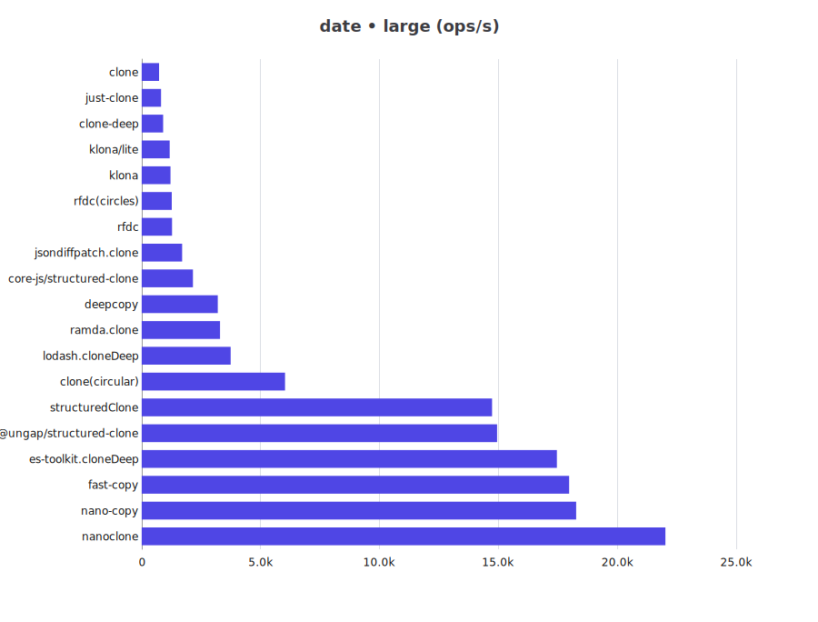
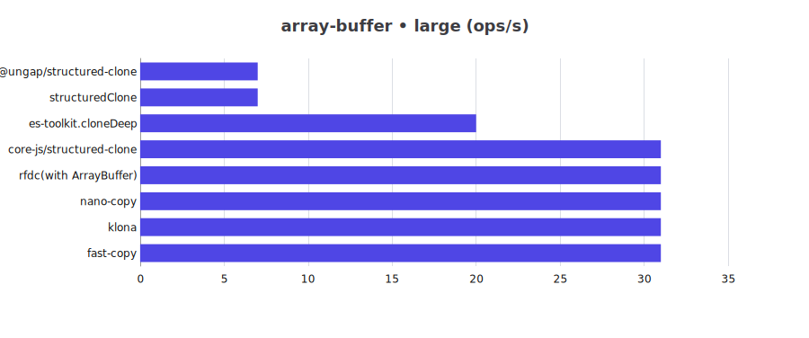

# JS Deep Clone Benchmark for Bun

This is a benchmark for JS deep clone libraries for Bun.

## Benchmark Results

for Node please refer to [Node](README.md)

cpu: 13th Gen Intel(R) Core(TM) i5-13400F
runtime: bun 1.2.21 (x64-win32)

### json

| Library | small (ops/s) | large (ops/s) |
| -- | --: | --: |
| @ungap/structured-clone | 28,919 | 2,922 |
| clone | 32,737 | 320 |
| clone-deep | 169,315 | 786 |
| clone(circular) | 30,293 | 1,983 |
| copy-anything | 44,425 | 427 |
| core-js/structured-clone | 12,423 | 1,605 |
| deepcopy | 13,400 | 1,112 |
| es-toolkit.cloneDeep | 56,429 | 2,938 |
| fast-copy | 169,161 | 4,216 |
| fastest-json-copy | 322,292 | 1,419 |
| JSON.stringify/parse | 43,069 | 773 |
| just-clone | 32,197 | 400 |
| klona | 241,048 | 1,133 |
| klona/json | 341,113 | 1,224 |
| klona/lite | 245,983 | 1,115 |
| lodash.cloneDeep | 28,584 | 2,016 |
| nano-copy | 134,491 | 5,208 |
| nanoclone | 88,099 | 8,635 |
| plain-object-clone | 28,895 | 507 |
| ramda.clone | 9,294 | 657 |
| rfdc | 36,798 | 626 |
| rfdc(circles) | 36,047 | 620 |
| structuredClone | 29,801 | 2,980 |

### json-circular

| Library | small (ops/s) | large (ops/s) |
| -- | --: | --: |
| @ungap/structured-clone | 372,941 | 594 |
| clone(circular) | 481,771 | 258 |
| core-js/structured-clone | 341,991 | 252 |
| deepcopy | 300,222 | 266 |
| es-toolkit.cloneDeep | 798,119 | 1,121 |
| fast-copy | 1,030,884 | 2,746 |
| lodash.cloneDeep | 526,661 | 568 |
| nano-copy | 1,171,409 | 2,687 |
| nanoclone | 2,073,221 | 1,897 |
| ramda.clone | 260,905 | 53 |
| rfdc(circles) | 1,235,547 | 1,118 |
| structuredClone | 381,779 | 598 |

### regexp

| Library | small (ops/s) | large (ops/s) |
| -- | --: | --: |
| @ungap/structured-clone | 59,621 | 9,430 |
| clone | 47,244 | 710 |
| clone-deep | 48,982 | 612 |
| clone(circular) | 44,860 | 4,451 |
| core-js/structured-clone | 30,587 | 3,256 |
| deepcopy | 21,384 | 2,222 |
| es-toolkit.cloneDeep | 52,572 | 5,595 |
| fast-copy | 56,321 | 6,069 |
| just-clone | 89,045 | 1,256 |
| klona | 76,244 | 1,078 |
| klona/lite | 75,588 | 1,106 |
| lodash.cloneDeep | 25,150 | 2,161 |
| nano-copy | 163,853 | 15,059 |
| nanoclone | 246,587 | 20,135 |
| ramda.clone | 27,336 | 2,477 |
| rfdc(with RegExp) | 72,074 | 1,029 |
| structuredClone | 60,510 | 9,140 |

### date

| Library | small (ops/s) | large (ops/s) |
| -- | --: | --: |
| @ungap/structured-clone | 44,773 | 15,818 |
| clone | 61,200 | 748 |
| clone-deep | 81,942 | 1,002 |
| clone(circular) | 52,458 | 6,666 |
| core-js/structured-clone | 14,335 | 2,406 |
| deepcopy | 15,821 | 3,410 |
| es-toolkit.cloneDeep | 56,239 | 18,758 |
| fast-copy | 87,061 | 18,366 |
| just-clone | 45,419 | 825 |
| klona | 66,556 | 1,266 |
| klona/lite | 66,705 | 1,255 |
| lodash.cloneDeep | 23,359 | 4,235 |
| nano-copy | 63,223 | 19,510 |
| nanoclone | 88,386 | 23,259 |
| ramda.clone | 17,276 | 3,408 |
| rfdc | 73,493 | 1,341 |
| rfdc(circles) | 74,881 | 1,330 |
| structuredClone | 46,427 | 15,563 |

### custom-class

| Library | small (ops/s) | large (ops/s) |
| -- | --: | --: |
| clone | 663,270 | 1,984 |
| clone(circular) | 620,593 | 1,191 |
| es-toolkit.cloneDeep | 826,821 | 2,156 |
| fast-copy | 1,375,326 | 5,028 |
| klona | 1,976,441 | 5,952 |
| klona/lite | 1,984,223 | 5,956 |
| lodash.cloneDeep | 629,176 | 1,441 |
| nano-copy | 1,837,388 | 7,254 |
| ramda.clone | 212,990 | 307 |
| rfdc(with Custom Classes) | 1,394,695 | 3,611 |

### array-buffer

| Library | small (ops/s) | large (ops/s) |
| -- | --: | --: |
| @ungap/structured-clone | 18,617 | 7 |
| core-js/structured-clone | 28,796 | 30 |
| es-toolkit.cloneDeep | 19,416 | 20 |
| fast-copy | 21,955 | 29 |
| klona | 24,213 | 29 |
| nano-copy | 25,632 | 29 |
| rfdc(with ArrayBuffer) | 26,355 | 29 |
| structuredClone | 18,292 | 7 |

### buffer

| Library | small (ops/s) | large (ops/s) |
| -- | --: | --: |
| clone | 60,397 | 35 |
| clone(circular) | 63,075 | 34 |
| deepcopy | 32,576 | 16 |
| klona | 118,056 | 32 |
| nano-copy | 116,133 | 31 |
| rfdc | 125,255 | 32 |
| rfdc(circles) | 119,964 | 32 |

### buffer-zero-copy

| Library | small (ops/s) | large (ops/s) |
| -- | --: | --: |
| es-toolkit.cloneDeep | 354,530 | 410,472 |
| lodash.cloneDeep | 369,645 | 402,315 |

### map-set

| Library | small (ops/s) | large (ops/s) |
| -- | --: | --: |
| @ungap/structured-clone | 66,656 | 7,530 |
| clone | 113,976 | 28,127 |
| clone(circular) | 101,690 | 20,856 |
| core-js/structured-clone | 36,239 | 3,281 |
| deepcopy | 40,172 | 4,201 |
| es-toolkit.cloneDeep | 94,978 | 12,729 |
| fast-copy | 191,075 | 28,202 |
| just-clone | 66,556 | 6,292 |
| klona | 152,264 | 20,627 |
| lodash.cloneDeep | 72,508 | 5,317 |
| nano-copy | 54,903 | 9,105 |
| nanoclone | 104,874 | 16,424 |
| rfdc | 58,526 | 4,937 |
| rfdc(circles) | 58,905 | 5,597 |
| structuredClone | 66,391 | 7,461 |

## Clone Support Matrix

| Library | json | json-circular | regexp | date | custom-class | array-buffer | buffer | map-set |
| -- | -- | -- | -- | -- | -- | -- | -- | -- |
| @ungap/structured-clone | ✅ | ✅ | ✅ | ✅ | ❌ | ✅ | ❌ | ✅ |
| clone | ✅ | ✅ | ✅ | ✅ | ✅ | ❌ | ✅ | ✅ |
| clone-deep | ✅ | ❌ | ✅ | ✅ | ❌ | ❌ | ❌ | ❌ |
| copy-anything | ✅ | ❌ | ❌ | ❌ | ❌ | ❌ | ❌ | ❌ |
| core-js/structured-clone | ✅ | ✅ | ✅ | ✅ | ❌ | ✅ | ❌ | ✅ |
| deepcopy | ✅ | ✅ | ✅ | ✅ | ❌ | ❌ | ✅ | ✅ |
| es-toolkit.cloneDeep | ✅ | ✅ | ✅ | ✅ | ✅ | ✅ | ❌ | ✅ |
| fast-copy | ✅ | ✅ | ✅ | ✅ | ✅ | ✅ | ❌ | ✅ |
| fastest-json-copy | ✅ | ❌ | ❌ | ❌ | ❌ | ❌ | ❌ | ❌ |
| JSON.stringify/parse | ✅ | ❌ | ❌ | ❌ | ❌ | ❌ | ❌ | ❌ |
| just-clone | ✅ | ❌ | ✅ | ✅ | ❌ | ❌ | ❌ | ✅ |
| klona | ✅ | ❌ | ✅ | ✅ | ✅ | ✅ | ✅ | ✅ |
| klona/json | ✅ | ❌ | ❌ | ❌ | ❌ | ❌ | ❌ | ❌ |
| klona/lite | ✅ | ❌ | ✅ | ✅ | ✅ | ❌ | ❌ | ❌ |
| lodash.cloneDeep | ✅ | ✅ | ✅ | ✅ | ✅ | ❌ | ❌ | ✅ |
| nano-copy | ✅ | ✅ | ✅ | ✅ | ✅ | ✅ | ✅ | ✅ |
| nanoclone | ✅ | ✅ | ✅ | ✅ | ❌ | ❌ | ❌ | ✅ |
| plain-object-clone | ✅ | ❌ | ❌ | ❌ | ❌ | ❌ | ❌ | ❌ |
| ramda.clone | ✅ | ✅ | ✅ | ✅ | ✅ | ❌ | ❌ | ❌ |
| rfdc | ✅ | ✅ | ⚠️ | ✅ | ⚠️ | ⚠️ | ✅ | ✅ |
| structuredClone | ✅ | ✅ | ✅ | ✅ | ❌ | ✅ | ❌ | ✅ |

> ⚠️: need customize manually to support
