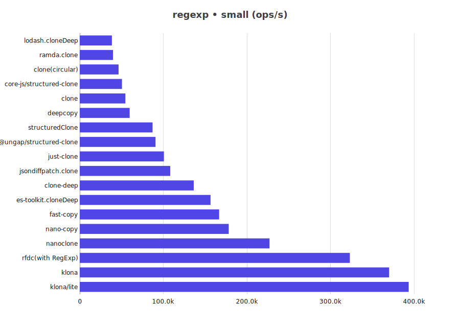
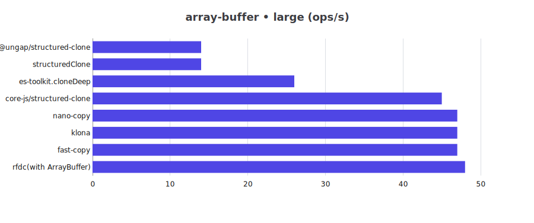

# JS Deep Clone Benchmark

This is a benchmark for JS deep clone libraries.

## Clone Support Matrix

| Library | json | json-circular | regexp | date | custom-class | array-buffer | buffer | map-set |
| -- | -- | -- | -- | -- | -- | -- | -- | -- |
| @ungap/structured-clone | ✅ | ✅ | ✅ | ✅ | ❌ | ✅ | ❌ | ✅ |
| clone | ✅ | ✅ | ✅ | ✅ | ✅ | ❌ | ✅ | ✅ |
| clone-deep | ✅ | ❌ | ✅ | ✅ | ❌ | ❌ | ❌ | ❌ |
| copy-anything | ✅ | ❌ | ❌ | ❌ | ❌ | ❌ | ❌ | ❌ |
| core-js/structured-clone | ✅ | ✅ | ✅ | ✅ | ❌ | ✅ | ❌ | ✅ |
| deepcopy | ✅ | ✅ | ✅ | ✅ | ❌ | ❌ | ✅ | ✅ |
| es-toolkit.cloneDeep | ✅ | ✅ | ✅ | ✅ | ✅ | ✅ | ❌ | ✅ |
| fast-copy | ✅ | ✅ | ✅ | ✅ | ✅ | ✅ | ❌ | ✅ |
| fastest-json-copy | ✅ | ❌ | ❌ | ❌ | ❌ | ❌ | ❌ | ❌ |
| JSON.stringify/parse | ✅ | ❌ | ❌ | ❌ | ❌ | ❌ | ❌ | ❌ |
| jsondiffpatch.clone | ✅ | ❌ | ✅ | ✅ | ❌ | ❌ | ❌ | ❌ |
| just-clone | ✅ | ❌ | ✅ | ✅ | ❌ | ❌ | ❌ | ✅ |
| klona | ✅ | ❌ | ✅ | ✅ | ✅ | ✅ | ✅ | ✅ |
| klona/json | ✅ | ❌ | ❌ | ❌ | ❌ | ❌ | ❌ | ❌ |
| klona/lite | ✅ | ❌ | ✅ | ✅ | ✅ | ❌ | ❌ | ❌ |
| lodash.cloneDeep | ✅ | ✅ | ✅ | ✅ | ✅ | ❌ | ❌ | ✅ |
| nano-copy | ✅ | ✅ | ✅ | ✅ | ✅ | ✅ | ✅ | ✅ |
| nanoclone | ✅ | ✅ | ✅ | ✅ | ❌ | ❌ | ❌ | ✅ |
| plain-object-clone | ✅ | ❌ | ❌ | ❌ | ❌ | ❌ | ❌ | ❌ |
| ramda.clone | ✅ | ✅ | ✅ | ✅ | ✅ | ❌ | ❌ | ❌ |
| rfdc | ✅ | ✅ | ⚠️ | ✅ | ⚠️ | ⚠️ | ✅ | ✅ |
| structuredClone | ✅ | ✅ | ✅ | ✅ | ❌ | ✅ | ❌ | ✅ |

> ⚠️: need customize manually to support

## Benchmark Results

for Bun please refer to [Bun](README.bun.md)

cpu: 13th Gen Intel(R) Core(TM) i5-13400F

runtime: node 24.8.0 (x64-win32)

### json

| Library | small (ops/s) | large (ops/s) |
| -- | --: | --: |
| @ungap/structured-clone | 40,666 | 4,603 |
| clone | 20,561 | 344 |
| clone-deep | 93,042 | 1,698 |
| clone(circular) | 17,622 | 1,868 |
| copy-anything | 29,734 | 503 |
| core-js/structured-clone | 15,556 | 1,857 |
| deepcopy | 18,565 | 2,031 |
| es-toolkit.cloneDeep | 52,959 | 5,253 |
| fast-copy | 99,862 | 9,718 |
| fastest-json-copy | 223,203 | 3,802 |
| JSON.stringify/parse | 71,548 | 1,322 |
| jsondiffpatch.clone | 305,298 | 5,314 |
| just-clone | 24,359 | 415 |
| klona | 247,348 | 4,276 |
| klona/json | 311,466 | 5,401 |
| klona/lite | 279,231 | 4,744 |
| lodash.cloneDeep | 30,553 | 3,253 |
| nano-copy | 103,740 | 10,698 |
| nanoclone | 134,697 | 14,045 |
| plain-object-clone | 53,516 | 949 |
| ramda.clone | 9,735 | 576 |
| rfdc | 151,328 | 2,704 |
| rfdc(circles) | 140,351 | 2,413 |
| structuredClone | 40,546 | 4,469 |

### json-circular

| Library | small (ops/s) | large (ops/s) |
| -- | --: | --: |
| @ungap/structured-clone | 516,688 | 747 |
| clone(circular) | 366,152 | 184 |
| core-js/structured-clone | 332,227 | 274 |
| deepcopy | 608,239 | 342 |
| es-toolkit.cloneDeep | 1,438,584 | 1,051 |
| fast-copy | 2,560,951 | 1,552 |
| lodash.cloneDeep | 925,953 | 608 |
| nano-copy | 2,727,370 | 1,808 |
| nanoclone | 3,737,974 | 2,356 |
| ramda.clone | 271,897 | 63 |
| rfdc(circles) | 3,809,646 | 2,475 |
| structuredClone | 536,569 | 733 |

### regexp

| Library | small (ops/s) | large (ops/s) |
| -- | --: | --: |
| @ungap/structured-clone | 95,531 | 11,189 |
| clone | 54,366 | 804 |
| clone-deep | 139,025 | 2,015 |
| clone(circular) | 47,357 | 4,562 |
| core-js/structured-clone | 51,706 | 5,973 |
| deepcopy | 59,582 | 6,509 |
| es-toolkit.cloneDeep | 144,224 | 15,344 |
| fast-copy | 163,577 | 16,999 |
| jsondiffpatch.clone | 106,954 | 1,567 |
| just-clone | 100,953 | 2,941 |
| klona | 388,899 | 5,849 |
| klona/lite | 412,612 | 5,862 |
| lodash.cloneDeep | 40,024 | 3,519 |
| nano-copy | 180,148 | 18,776 |
| nanoclone | 235,787 | 23,036 |
| ramda.clone | 40,498 | 4,082 |
| rfdc(with RegExp) | 320,525 | 4,877 |
| structuredClone | 94,155 | 10,721 |

### date

| Library | small (ops/s) | large (ops/s) |
| -- | --: | --: |
| @ungap/structured-clone | 49,639 | 14,494 |
| clone | 25,406 | 452 |
| clone-deep | 69,580 | 1,287 |
| clone(circular) | 21,115 | 3,280 |
| core-js/structured-clone | 14,042 | 2,075 |
| deepcopy | 28,680 | 6,336 |
| es-toolkit.cloneDeep | 67,043 | 19,633 |
| fast-copy | 73,992 | 15,470 |
| jsondiffpatch.clone | 301,563 | 5,876 |
| just-clone | 133,203 | 2,275 |
| klona | 150,264 | 2,747 |
| klona/lite | 157,328 | 2,848 |
| lodash.cloneDeep | 30,124 | 4,615 |
| nano-copy | 105,022 | 19,181 |
| nanoclone | 144,683 | 27,277 |
| ramda.clone | 18,136 | 3,103 |
| rfdc | 223,439 | 3,971 |
| rfdc(circles) | 206,164 | 3,556 |
| structuredClone | 50,673 | 14,579 |

### custom-class

| Library | small (ops/s) | large (ops/s) |
| -- | --: | --: |
| clone | 361,675 | 1,099 |
| clone(circular) | 314,893 | 709 |
| es-toolkit.cloneDeep | 1,015,604 | 2,838 |
| fast-copy | 961,700 | 3,074 |
| klona | 1,933,790 | 6,335 |
| klona/lite | 2,087,899 | 6,987 |
| lodash.cloneDeep | 623,976 | 1,622 |
| nano-copy | 1,543,168 | 4,916 |
| ramda.clone | 221,296 | 373 |
| rfdc(with Custom Classes) | 3,718,964 | 10,963 |

### array-buffer

| Library | small (ops/s) | large (ops/s) |
| -- | --: | --: |
| @ungap/structured-clone | 40,395 | 14 |
| core-js/structured-clone | 33,734 | 47 |
| es-toolkit.cloneDeep | 28,571 | 26 |
| fast-copy | 39,575 | 48 |
| klona | 46,740 | 48 |
| nano-copy | 48,131 | 49 |
| rfdc(with ArrayBuffer) | 50,325 | 49 |
| structuredClone | 40,460 | 14 |

### buffer

| Library | small (ops/s) | large (ops/s) |
| -- | --: | --: |
| clone | 50,820 | 52 |
| clone(circular) | 48,384 | 52 |
| deepcopy | 32,173 | 27 |
| klona | 55,299 | 52 |
| nano-copy | 64,509 | 52 |
| rfdc | 63,749 | 52 |
| rfdc(circles) | 67,155 | 52 |

### buffer-zero-copy

| Library | small (ops/s) | large (ops/s) |
| -- | --: | --: |
| es-toolkit.cloneDeep | 914,192 | 921,485 |
| lodash.cloneDeep | 383,552 | 371,446 |

### map-set

| Library | small (ops/s) | large (ops/s) |
| -- | --: | --: |
| @ungap/structured-clone | 118,652 | 12,688 |
| clone | 102,009 | 9,695 |
| clone(circular) | 84,067 | 7,756 |
| core-js/structured-clone | 38,108 | 4,090 |
| deepcopy | 85,371 | 8,363 |
| es-toolkit.cloneDeep | 274,966 | 24,602 |
| fast-copy | 263,696 | 24,058 |
| just-clone | 222,739 | 24,275 |
| klona | 408,790 | 37,674 |
| lodash.cloneDeep | 66,928 | 5,653 |
| nano-copy | 158,587 | 14,805 |
| nanoclone | 414,181 | 36,774 |
| rfdc | 153,617 | 19,880 |
| rfdc(circles) | 154,431 | 19,371 |
| structuredClone | 117,270 | 12,565 |

