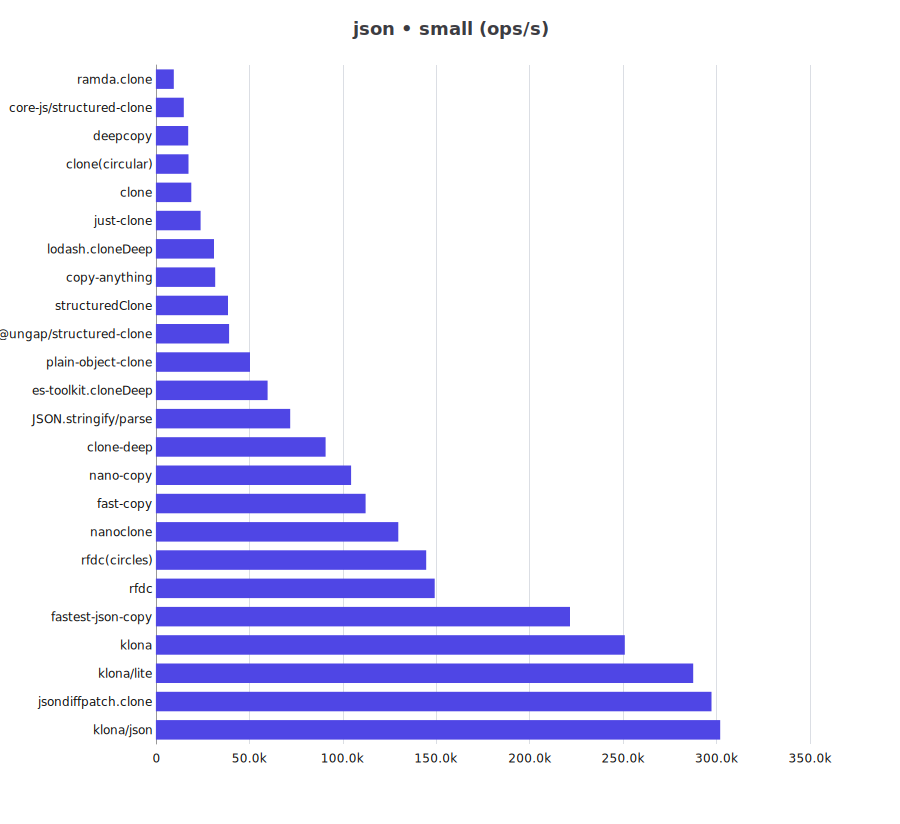
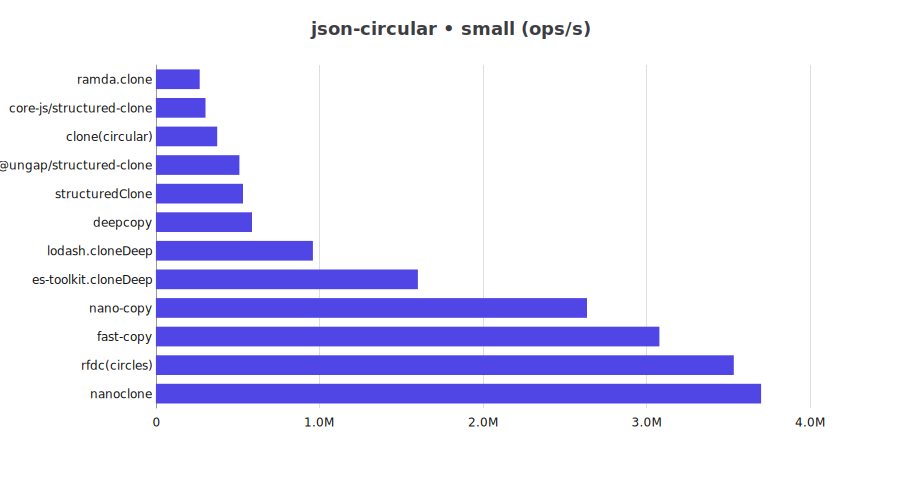
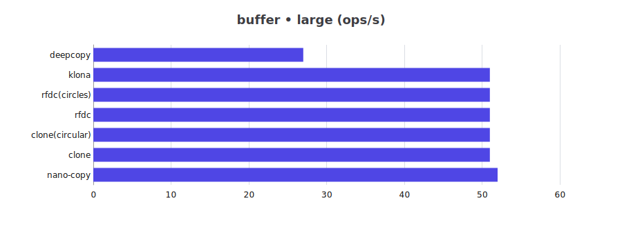

# JS Deep Clone Benchmark

This is a benchmark for JS deep clone libraries.

## Clone Support Matrix

| Library | json | json-circular | regexp | date | custom-class | array-buffer | buffer | map-set |
| -- | -- | -- | -- | -- | -- | -- | -- | -- |
| @ungap/structured-clone | ✅ | ✅ | ✅ | ✅ | ❌ | ✅ | ❌ | ✅ |
| clone | ✅ | ✅ | ✅ | ✅ | ✅ | ❌ | ✅ | ✅ |
| clone-deep | ✅ | ❌ | ✅ | ✅ | ❌ | ❌ | ❌ | ❌ |
| copy-anything | ✅ | ❌ | ❌ | ❌ | ❌ | ❌ | ❌ | ❌ |
| core-js/structured-clone | ✅ | ✅ | ✅ | ✅ | ❌ | ✅ | ❌ | ✅ |
| deepcopy | ✅ | ✅ | ✅ | ✅ | ❌ | ❌ | ✅ | ✅ |
| es-toolkit.cloneDeep | ✅ | ✅ | ✅ | ✅ | ✅ | ✅ | ❌ | ✅ |
| fast-copy | ✅ | ✅ | ✅ | ✅ | ✅ | ✅ | ❌ | ✅ |
| fastest-json-copy | ✅ | ❌ | ❌ | ❌ | ❌ | ❌ | ❌ | ❌ |
| JSON.stringify/parse | ✅ | ❌ | ❌ | ❌ | ❌ | ❌ | ❌ | ❌ |
| just-clone | ✅ | ❌ | ✅ | ✅ | ❌ | ❌ | ❌ | ✅ |
| klona | ✅ | ❌ | ✅ | ✅ | ✅ | ✅ | ✅ | ✅ |
| klona/json | ✅ | ❌ | ❌ | ❌ | ❌ | ❌ | ❌ | ❌ |
| klona/lite | ✅ | ❌ | ✅ | ✅ | ✅ | ❌ | ❌ | ❌ |
| lodash.cloneDeep | ✅ | ✅ | ✅ | ✅ | ✅ | ❌ | ❌ | ✅ |
| nano-copy | ✅ | ✅ | ✅ | ✅ | ✅ | ✅ | ✅ | ✅ |
| nanoclone | ✅ | ✅ | ✅ | ✅ | ❌ | ❌ | ❌ | ✅ |
| plain-object-clone | ✅ | ❌ | ❌ | ❌ | ❌ | ❌ | ❌ | ❌ |
| ramda.clone | ✅ | ✅ | ✅ | ✅ | ✅ | ❌ | ❌ | ❌ |
| rfdc | ✅ | ✅ | ⚠️ | ✅ | ⚠️ | ⚠️ | ✅ | ✅ |
| structuredClone | ✅ | ✅ | ✅ | ✅ | ❌ | ✅ | ❌ | ✅ |

> ⚠️: need customize manually to support

## Benchmark Results

for Bun please refer to [Bun](README.bun.md)

cpu: 13th Gen Intel(R) Core(TM) i5-13400F

runtime: node 24.8.0 (x64-win32)

### json

| Library | small (ops/s) | large (ops/s) |
| -- | --: | --: |
| @ungap/structured-clone | 41,132 | 4,730 |
| clone | 20,314 | 354 |
| clone-deep | 96,850 | 1,731 |
| clone(circular) | 18,017 | 1,937 |
| copy-anything | 32,113 | 511 |
| core-js/structured-clone | 15,301 | 1,840 |
| deepcopy | 18,781 | 2,143 |
| es-toolkit.cloneDeep | 52,623 | 5,195 |
| fast-copy | 106,290 | 10,415 |
| fastest-json-copy | 219,735 | 4,022 |
| JSON.stringify/parse | 78,689 | 1,391 |
| just-clone | 24,655 | 424 |
| klona | 271,176 | 4,602 |
| klona/json | 319,770 | 5,566 |
| klona/lite | 294,095 | 4,944 |
| lodash.cloneDeep | 32,130 | 3,377 |
| nano-copy | 102,511 | 10,804 |
| nanoclone | 145,374 | 14,324 |
| plain-object-clone | 51,821 | 933 |
| ramda.clone | 9,714 | 676 |
| rfdc | 168,016 | 2,825 |
| rfdc(circles) | 139,002 | 2,398 |
| structuredClone | 40,268 | 4,519 |

### json-circular

| Library | small (ops/s) | large (ops/s) |
| -- | --: | --: |
| @ungap/structured-clone | 549,175 | 754 |
| clone(circular) | 368,451 | 198 |
| core-js/structured-clone | 308,384 | 291 |
| deepcopy | 598,160 | 350 |
| es-toolkit.cloneDeep | 1,502,377 | 1,062 |
| fast-copy | 2,689,444 | 1,494 |
| lodash.cloneDeep | 977,580 | 617 |
| nano-copy | 2,598,807 | 1,875 |
| nanoclone | 3,993,324 | 2,393 |
| ramda.clone | 275,654 | 68 |
| rfdc(circles) | 3,805,678 | 2,649 |
| structuredClone | 538,098 | 745 |

### regexp

| Library | small (ops/s) | large (ops/s) |
| -- | --: | --: |
| @ungap/structured-clone | 97,430 | 10,984 |
| clone | 56,840 | 836 |
| clone-deep | 138,867 | 2,152 |
| clone(circular) | 48,465 | 4,675 |
| core-js/structured-clone | 52,287 | 6,345 |
| deepcopy | 60,637 | 6,646 |
| es-toolkit.cloneDeep | 151,068 | 15,429 |
| fast-copy | 162,295 | 17,617 |
| just-clone | 108,672 | 2,934 |
| klona | 396,748 | 5,805 |
| klona/lite | 425,050 | 6,379 |
| lodash.cloneDeep | 41,525 | 3,633 |
| nano-copy | 181,194 | 18,734 |
| nanoclone | 241,709 | 23,623 |
| ramda.clone | 41,904 | 4,264 |
| rfdc(with RegExp) | 336,323 | 4,759 |
| structuredClone | 97,697 | 11,160 |

### date

| Library | small (ops/s) | large (ops/s) |
| -- | --: | --: |
| @ungap/structured-clone | 51,022 | 15,027 |
| clone | 25,527 | 477 |
| clone-deep | 75,161 | 1,312 |
| clone(circular) | 21,676 | 3,299 |
| core-js/structured-clone | 14,223 | 2,123 |
| deepcopy | 28,733 | 6,651 |
| es-toolkit.cloneDeep | 71,033 | 19,878 |
| fast-copy | 74,718 | 15,651 |
| just-clone | 131,054 | 2,286 |
| klona | 160,769 | 2,888 |
| klona/lite | 154,530 | 2,897 |
| lodash.cloneDeep | 31,022 | 4,669 |
| nano-copy | 99,474 | 19,541 |
| nanoclone | 145,257 | 26,772 |
| ramda.clone | 18,755 | 3,216 |
| rfdc | 213,199 | 3,994 |
| rfdc(circles) | 209,984 | 3,570 |
| structuredClone | 52,012 | 15,181 |

### custom-class

| Library | small (ops/s) | large (ops/s) |
| -- | --: | --: |
| clone | 377,679 | 1,132 |
| clone(circular) | 327,267 | 760 |
| es-toolkit.cloneDeep | 995,611 | 2,860 |
| fast-copy | 1,114,714 | 3,456 |
| klona | 2,003,158 | 6,890 |
| klona/lite | 2,125,210 | 7,140 |
| lodash.cloneDeep | 643,019 | 1,657 |
| nano-copy | 1,524,649 | 5,013 |
| ramda.clone | 232,138 | 383 |
| rfdc(with Custom Classes) | 3,805,270 | 11,142 |

### array-buffer

| Library | small (ops/s) | large (ops/s) |
| -- | --: | --: |
| @ungap/structured-clone | 40,330 | 14 |
| core-js/structured-clone | 33,011 | 47 |
| es-toolkit.cloneDeep | 30,863 | 27 |
| fast-copy | 42,816 | 49 |
| klona | 46,863 | 49 |
| nano-copy | 50,244 | 49 |
| rfdc(with ArrayBuffer) | 53,271 | 49 |
| structuredClone | 41,130 | 14 |

### buffer

| Library | small (ops/s) | large (ops/s) |
| -- | --: | --: |
| clone | 46,318 | 51 |
| clone(circular) | 49,859 | 53 |
| deepcopy | 31,726 | 28 |
| klona | 49,702 | 53 |
| nano-copy | 64,115 | 53 |
| rfdc | 65,455 | 53 |
| rfdc(circles) | 66,018 | 53 |

### buffer-zero-copy

| Library | small (ops/s) | large (ops/s) |
| -- | --: | --: |
| es-toolkit.cloneDeep | 945,646 | 971,910 |
| lodash.cloneDeep | 377,029 | 371,219 |

### map-set

| Library | small (ops/s) | large (ops/s) |
| -- | --: | --: |
| @ungap/structured-clone | 119,293 | 12,936 |
| clone | 100,592 | 9,806 |
| clone(circular) | 90,184 | 7,808 |
| core-js/structured-clone | 40,675 | 4,163 |
| deepcopy | 89,621 | 8,988 |
| es-toolkit.cloneDeep | 272,872 | 25,459 |
| fast-copy | 274,001 | 24,477 |
| just-clone | 224,608 | 25,131 |
| klona | 417,467 | 38,018 |
| lodash.cloneDeep | 73,427 | 5,716 |
| nano-copy | 150,495 | 15,140 |
| nanoclone | 425,143 | 37,400 |
| rfdc | 153,789 | 20,733 |
| rfdc(circles) | 152,258 | 20,159 |
| structuredClone | 123,084 | 13,556 |

