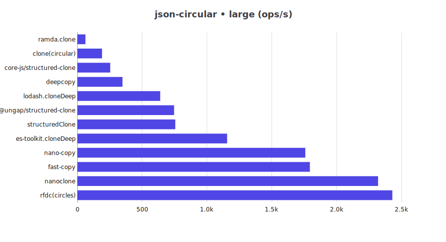
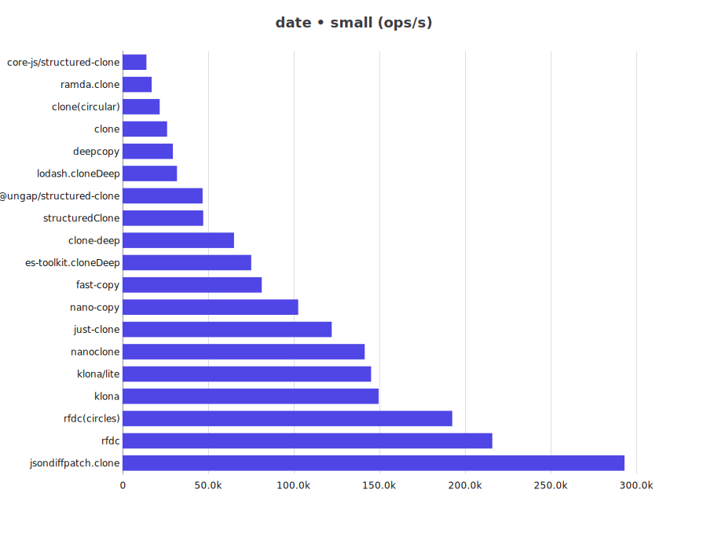
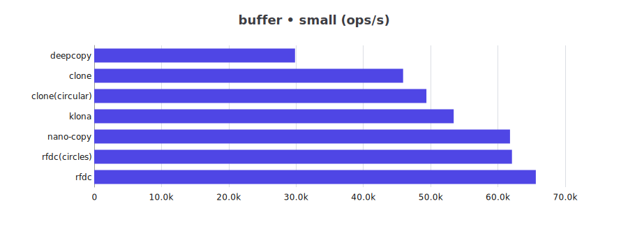
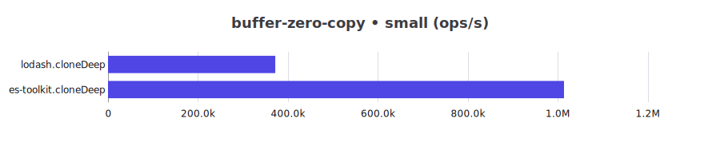
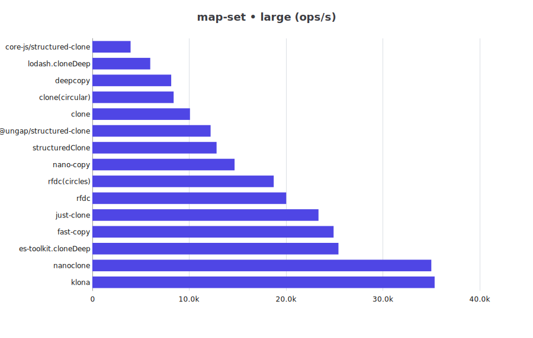

# JS Deep Clone Benchmark

This is a benchmark for JS deep clone libraries.

## Clone Support Matrix

| Library | json | json-circular | regexp | date | custom-class | array-buffer | buffer | map-set |
| -- | -- | -- | -- | -- | -- | -- | -- | -- |
| @ungap/structured-clone | ✅ | ✅ | ✅ | ✅ | ❌ | ✅ | ❌ | ✅ |
| clone | ✅ | ✅ | ✅ | ✅ | ✅ | ❌ | ✅ | ✅ |
| clone-deep | ✅ | ❌ | ✅ | ✅ | ❌ | ❌ | ❌ | ❌ |
| copy-anything | ✅ | ❌ | ❌ | ❌ | ❌ | ❌ | ❌ | ❌ |
| core-js/structured-clone | ✅ | ✅ | ✅ | ✅ | ❌ | ✅ | ❌ | ✅ |
| deepcopy | ✅ | ✅ | ✅ | ✅ | ❌ | ❌ | ✅ | ✅ |
| es-toolkit.cloneDeep | ✅ | ✅ | ✅ | ✅ | ✅ | ✅ | ❌ | ✅ |
| fast-copy | ✅ | ✅ | ✅ | ✅ | ✅ | ✅ | ❌ | ✅ |
| fastest-json-copy | ✅ | ❌ | ❌ | ❌ | ❌ | ❌ | ❌ | ❌ |
| JSON.stringify/parse | ✅ | ❌ | ❌ | ❌ | ❌ | ❌ | ❌ | ❌ |
| just-clone | ✅ | ❌ | ✅ | ✅ | ❌ | ❌ | ❌ | ✅ |
| klona | ✅ | ❌ | ✅ | ✅ | ✅ | ✅ | ✅ | ✅ |
| klona/json | ✅ | ❌ | ❌ | ❌ | ❌ | ❌ | ❌ | ❌ |
| klona/lite | ✅ | ❌ | ✅ | ✅ | ✅ | ❌ | ❌ | ❌ |
| lodash.cloneDeep | ✅ | ✅ | ✅ | ✅ | ✅ | ❌ | ❌ | ✅ |
| nano-copy | ✅ | ✅ | ✅ | ✅ | ✅ | ✅ | ✅ | ✅ |
| nanoclone | ✅ | ✅ | ✅ | ✅ | ❌ | ❌ | ❌ | ✅ |
| plain-object-clone | ✅ | ❌ | ❌ | ❌ | ❌ | ❌ | ❌ | ❌ |
| ramda.clone | ✅ | ✅ | ✅ | ✅ | ✅ | ❌ | ❌ | ❌ |
| rfdc | ✅ | ✅ | ⚠️ | ✅ | ⚠️ | ⚠️ | ✅ | ✅ |
| structuredClone | ✅ | ✅ | ✅ | ✅ | ❌ | ✅ | ❌ | ✅ |

> ⚠️: need customize manually to support

## Benchmark Results

for Bun please refer to [Bun](README.bun.md)

cpu: 13th Gen Intel(R) Core(TM) i5-13400F
runtime: node 24.8.0 (x64-win32)

### json

| Library | small (ops/s) | large (ops/s) |
| -- | --: | --: |
| @ungap/structured-clone | 40,785 | 4,754 |
| clone | 19,283 | 355 |
| clone-deep | 86,663 | 1,605 |
| clone(circular) | 16,768 | 1,922 |
| copy-anything | 30,935 | 520 |
| core-js/structured-clone | 15,263 | 1,895 |
| deepcopy | 18,847 | 2,112 |
| es-toolkit.cloneDeep | 51,156 | 5,429 |
| fast-copy | 104,150 | 10,057 |
| fastest-json-copy | 228,269 | 3,855 |
| JSON.stringify/parse | 78,604 | 1,377 |
| just-clone | 24,963 | 453 |
| klona | 257,954 | 4,444 |
| klona/json | 331,973 | 5,413 |
| klona/lite | 285,114 | 5,086 |
| lodash.cloneDeep | 31,930 | 3,239 |
| nano-copy | 109,150 | 10,924 |
| nanoclone | 140,336 | 14,536 |
| plain-object-clone | 53,850 | 915 |
| ramda.clone | 9,928 | 588 |
| rfdc | 162,744 | 2,806 |
| rfdc(circles) | 142,084 | 2,490 |
| structuredClone | 41,737 | 4,693 |

### json-circular

| Library | small (ops/s) | large (ops/s) |
| -- | --: | --: |
| @ungap/structured-clone | 545,643 | 774 |
| clone(circular) | 389,326 | 196 |
| core-js/structured-clone | 334,079 | 288 |
| deepcopy | 591,695 | 371 |
| es-toolkit.cloneDeep | 1,463,516 | 1,089 |
| fast-copy | 2,696,299 | 1,639 |
| lodash.cloneDeep | 950,983 | 629 |
| nano-copy | 2,820,701 | 1,975 |
| nanoclone | 3,868,517 | 2,383 |
| ramda.clone | 278,264 | 68 |
| rfdc(circles) | 4,108,571 | 2,679 |
| structuredClone | 561,370 | 781 |

### regexp

| Library | small (ops/s) | large (ops/s) |
| -- | --: | --: |
| @ungap/structured-clone | 99,011 | 11,445 |
| clone | 56,697 | 863 |
| clone-deep | 147,736 | 2,064 |
| clone(circular) | 48,611 | 4,767 |
| core-js/structured-clone | 53,236 | 6,347 |
| deepcopy | 60,056 | 7,094 |
| es-toolkit.cloneDeep | 151,829 | 16,000 |
| fast-copy | 168,971 | 17,699 |
| just-clone | 103,558 | 3,040 |
| klona | 405,473 | 6,015 |
| klona/lite | 426,357 | 6,185 |
| lodash.cloneDeep | 41,782 | 3,695 |
| nano-copy | 186,954 | 19,090 |
| nanoclone | 238,185 | 24,495 |
| ramda.clone | 42,306 | 4,298 |
| rfdc(with RegExp) | 338,248 | 4,966 |
| structuredClone | 98,045 | 11,600 |

### date

| Library | small (ops/s) | large (ops/s) |
| -- | --: | --: |
| @ungap/structured-clone | 52,940 | 15,107 |
| clone | 26,569 | 469 |
| clone-deep | 73,442 | 1,354 |
| clone(circular) | 22,335 | 3,415 |
| core-js/structured-clone | 14,425 | 2,163 |
| deepcopy | 29,399 | 6,515 |
| es-toolkit.cloneDeep | 72,147 | 20,234 |
| fast-copy | 79,060 | 15,711 |
| just-clone | 134,066 | 2,417 |
| klona | 160,822 | 2,884 |
| klona/lite | 161,216 | 2,993 |
| lodash.cloneDeep | 31,478 | 4,984 |
| nano-copy | 110,700 | 19,157 |
| nanoclone | 149,353 | 28,302 |
| ramda.clone | 18,924 | 3,299 |
| rfdc | 221,638 | 3,955 |
| rfdc(circles) | 211,403 | 3,796 |
| structuredClone | 52,970 | 15,092 |

### custom-class

| Library | small (ops/s) | large (ops/s) |
| -- | --: | --: |
| clone | 388,037 | 1,123 |
| clone(circular) | 330,815 | 746 |
| es-toolkit.cloneDeep | 1,019,825 | 2,971 |
| fast-copy | 1,126,005 | 3,430 |
| klona | 2,085,372 | 6,964 |
| klona/lite | 2,180,876 | 7,385 |
| lodash.cloneDeep | 649,829 | 1,643 |
| nano-copy | 1,628,281 | 5,179 |
| ramda.clone | 222,221 | 387 |
| rfdc(with Custom Classes) | 3,875,912 | 11,215 |

### array-buffer

| Library | small (ops/s) | large (ops/s) |
| -- | --: | --: |
| @ungap/structured-clone | 41,923 | 14 |
| core-js/structured-clone | 32,876 | 48 |
| es-toolkit.cloneDeep | 32,791 | 28 |
| fast-copy | 45,207 | 50 |
| klona | 46,144 | 50 |
| nano-copy | 46,749 | 49 |
| rfdc(with ArrayBuffer) | 51,914 | 50 |
| structuredClone | 40,674 | 14 |

### buffer

| Library | small (ops/s) | large (ops/s) |
| -- | --: | --: |
| clone | 49,153 | 52 |
| clone(circular) | 52,235 | 53 |
| deepcopy | 32,594 | 28 |
| klona | 56,619 | 54 |
| nano-copy | 63,704 | 54 |
| rfdc | 75,422 | 53 |
| rfdc(circles) | 67,935 | 53 |

### buffer-zero-copy

| Library | small (ops/s) | large (ops/s) |
| -- | --: | --: |
| es-toolkit.cloneDeep | 949,441 | 943,773 |
| lodash.cloneDeep | 395,639 | 383,365 |

### map-set

| Library | small (ops/s) | large (ops/s) |
| -- | --: | --: |
| @ungap/structured-clone | 124,249 | 13,282 |
| clone | 102,541 | 10,034 |
| clone(circular) | 89,309 | 8,091 |
| core-js/structured-clone | 41,152 | 4,182 |
| deepcopy | 94,459 | 9,004 |
| es-toolkit.cloneDeep | 273,292 | 25,671 |
| fast-copy | 276,026 | 24,939 |
| just-clone | 238,567 | 25,439 |
| klona | 419,527 | 38,725 |
| lodash.cloneDeep | 72,938 | 5,924 |
| nano-copy | 161,181 | 15,630 |
| nanoclone | 420,748 | 38,210 |
| rfdc | 163,267 | 21,171 |
| rfdc(circles) | 159,283 | 20,350 |
| structuredClone | 121,195 | 13,665 |

