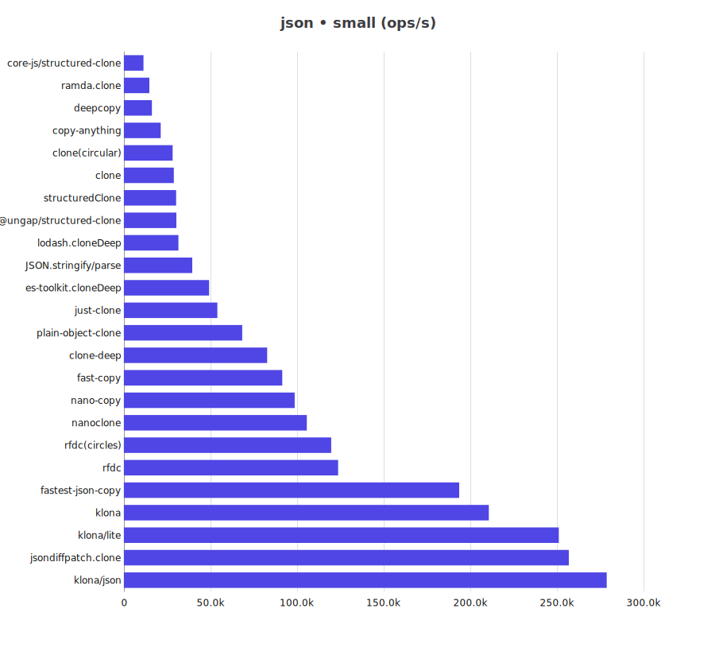
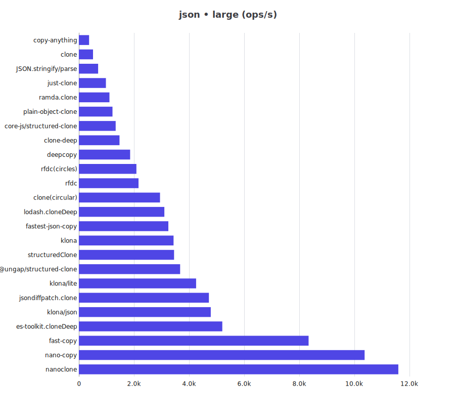
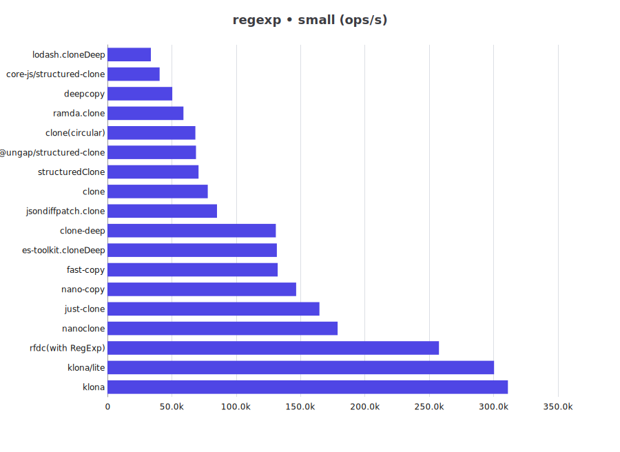
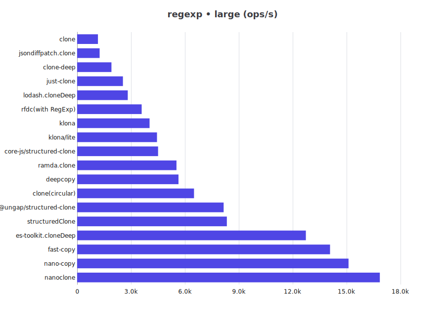
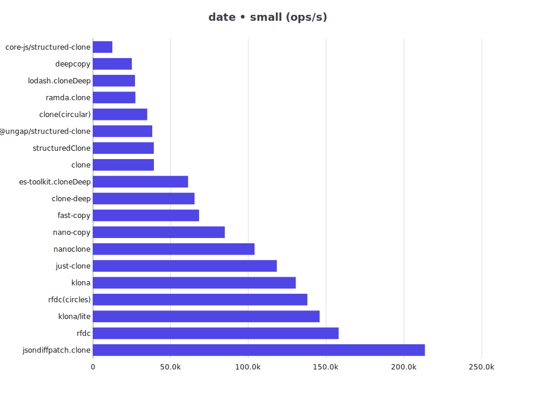
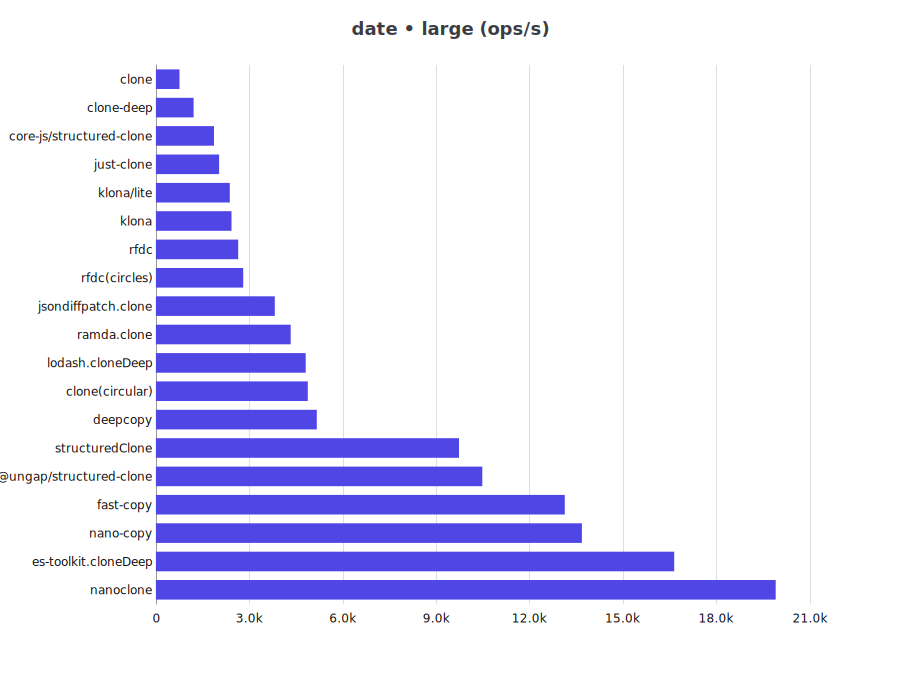
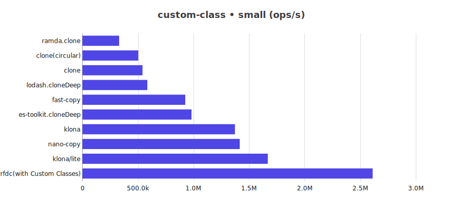
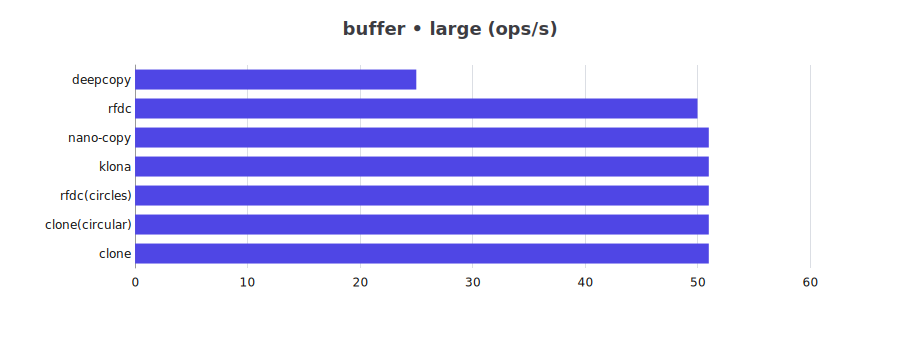
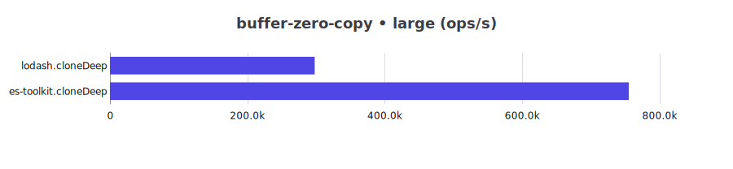

# JS Deep Clone Benchmark

This is a benchmark for JS deep clone libraries.

## Clone Support Matrix

| Library | json | json-circular | regexp | date | custom-class | array-buffer | buffer | map-set |
| -- | -- | -- | -- | -- | -- | -- | -- | -- |
| @ungap/structured-clone | ✅ | ✅ | ✅ | ✅ | ❌ | ✅ | ❌ | ✅ |
| clone | ✅ | ✅ | ✅ | ✅ | ✅ | ❌ | ✅ | ✅ |
| clone-deep | ✅ | ❌ | ✅ | ✅ | ❌ | ❌ | ❌ | ❌ |
| copy-anything | ✅ | ❌ | ❌ | ❌ | ❌ | ❌ | ❌ | ❌ |
| core-js/structured-clone | ✅ | ✅ | ✅ | ✅ | ❌ | ✅ | ❌ | ✅ |
| deepcopy | ✅ | ✅ | ✅ | ✅ | ❌ | ❌ | ✅ | ✅ |
| es-toolkit.cloneDeep | ✅ | ✅ | ✅ | ✅ | ✅ | ✅ | ❌ | ✅ |
| fast-copy | ✅ | ✅ | ✅ | ✅ | ✅ | ✅ | ❌ | ✅ |
| fastest-json-copy | ✅ | ❌ | ❌ | ❌ | ❌ | ❌ | ❌ | ❌ |
| JSON.stringify/parse | ✅ | ❌ | ❌ | ❌ | ❌ | ❌ | ❌ | ❌ |
| just-clone | ✅ | ❌ | ✅ | ✅ | ❌ | ❌ | ❌ | ✅ |
| klona | ✅ | ❌ | ✅ | ✅ | ✅ | ✅ | ✅ | ✅ |
| klona/json | ✅ | ❌ | ❌ | ❌ | ❌ | ❌ | ❌ | ❌ |
| klona/lite | ✅ | ❌ | ✅ | ✅ | ✅ | ❌ | ❌ | ❌ |
| lodash.cloneDeep | ✅ | ✅ | ✅ | ✅ | ✅ | ❌ | ❌ | ✅ |
| nano-copy | ✅ | ✅ | ✅ | ✅ | ✅ | ✅ | ✅ | ✅ |
| nanoclone | ✅ | ✅ | ✅ | ✅ | ❌ | ❌ | ❌ | ✅ |
| plain-object-clone | ✅ | ❌ | ❌ | ❌ | ❌ | ❌ | ❌ | ❌ |
| ramda.clone | ✅ | ✅ | ✅ | ✅ | ✅ | ❌ | ❌ | ❌ |
| rfdc | ✅ | ✅ | ⚠️ | ✅ | ⚠️ | ⚠️ | ✅ | ✅ |
| structuredClone | ✅ | ✅ | ✅ | ✅ | ❌ | ✅ | ❌ | ✅ |

> ⚠️: need customize manually to support

## Benchmark Results

for Bun please refer to [Bun](README.bun.md)

cpu: 13th Gen Intel(R) Core(TM) i5-13400F

runtime: node 20.19.5 (x64-win32)

### json

| Library | small (ops/s) | large (ops/s) |
| -- | --: | --: |
| @ungap/structured-clone | 30,312 | 3,677 |
| clone | 28,843 | 516 |
| clone-deep | 82,764 | 1,477 |
| clone(circular) | 28,183 | 2,946 |
| copy-anything | 21,291 | 373 |
| core-js/structured-clone | 11,307 | 1,337 |
| deepcopy | 16,193 | 1,862 |
| es-toolkit.cloneDeep | 49,220 | 5,207 |
| fast-copy | 91,447 | 8,338 |
| fastest-json-copy | 193,589 | 3,249 |
| JSON.stringify/parse | 39,476 | 700 |
| jsondiffpatch.clone | 256,897 | 4,720 |
| just-clone | 53,971 | 984 |
| klona | 210,696 | 3,439 |
| klona/json | 278,792 | 4,788 |
| klona/lite | 251,139 | 4,257 |
| lodash.cloneDeep | 31,492 | 3,104 |
| nano-copy | 98,595 | 10,371 |
| nanoclone | 105,652 | 11,594 |
| plain-object-clone | 68,342 | 1,222 |
| ramda.clone | 14,709 | 1,111 |
| rfdc | 123,681 | 2,167 |
| rfdc(circles) | 119,705 | 2,090 |
| structuredClone | 30,166 | 3,456 |

### json-circular

| Library | small (ops/s) | large (ops/s) |
| -- | --: | --: |
| @ungap/structured-clone | 467,531 | 588 |
| clone(circular) | 637,538 | 245 |
| core-js/structured-clone | 252,228 | 205 |
| deepcopy | 535,729 | 313 |
| es-toolkit.cloneDeep | 1,356,908 | 989 |
| fast-copy | 2,235,035 | 1,368 |
| lodash.cloneDeep | 929,994 | 629 |
| nano-copy | 2,262,073 | 1,593 |
| nanoclone | 3,189,773 | 2,035 |
| ramda.clone | 390,718 | 109 |
| rfdc(circles) | 3,072,022 | 2,107 |
| structuredClone | 448,045 | 563 |

### regexp

| Library | small (ops/s) | large (ops/s) |
| -- | --: | --: |
| @ungap/structured-clone | 68,813 | 8,158 |
| clone | 77,988 | 1,161 |
| clone-deep | 130,830 | 1,913 |
| clone(circular) | 68,355 | 6,509 |
| core-js/structured-clone | 40,548 | 4,507 |
| deepcopy | 50,412 | 5,644 |
| es-toolkit.cloneDeep | 131,612 | 12,734 |
| fast-copy | 132,302 | 14,079 |
| jsondiffpatch.clone | 85,139 | 1,255 |
| just-clone | 164,725 | 2,550 |
| klona | 311,100 | 4,033 |
| klona/lite | 300,343 | 4,446 |
| lodash.cloneDeep | 33,791 | 2,820 |
| nano-copy | 146,597 | 15,107 |
| nanoclone | 178,842 | 16,849 |
| ramda.clone | 59,080 | 5,531 |
| rfdc(with RegExp) | 257,557 | 3,594 |
| structuredClone | 70,793 | 8,336 |

### date

| Library | small (ops/s) | large (ops/s) |
| -- | --: | --: |
| @ungap/structured-clone | 38,304 | 10,479 |
| clone | 39,363 | 759 |
| clone-deep | 65,493 | 1,210 |
| clone(circular) | 35,102 | 4,878 |
| core-js/structured-clone | 12,647 | 1,864 |
| deepcopy | 25,187 | 5,167 |
| es-toolkit.cloneDeep | 61,327 | 16,641 |
| fast-copy | 68,420 | 13,127 |
| jsondiffpatch.clone | 213,603 | 3,817 |
| just-clone | 118,407 | 2,029 |
| klona | 130,616 | 2,428 |
| klona/lite | 145,949 | 2,373 |
| lodash.cloneDeep | 27,218 | 4,808 |
| nano-copy | 84,968 | 13,677 |
| nanoclone | 104,131 | 19,899 |
| ramda.clone | 27,491 | 4,327 |
| rfdc | 158,170 | 2,642 |
| rfdc(circles) | 138,062 | 2,804 |
| structuredClone | 39,318 | 9,732 |

### custom-class

| Library | small (ops/s) | large (ops/s) |
| -- | --: | --: |
| clone | 540,520 | 1,718 |
| clone(circular) | 502,531 | 963 |
| es-toolkit.cloneDeep | 981,154 | 2,822 |
| fast-copy | 925,201 | 2,939 |
| klona | 1,372,365 | 4,601 |
| klona/lite | 1,668,179 | 5,541 |
| lodash.cloneDeep | 583,728 | 1,446 |
| nano-copy | 1,415,628 | 4,582 |
| ramda.clone | 330,126 | 595 |
| rfdc(with Custom Classes) | 2,611,345 | 7,546 |

### array-buffer

| Library | small (ops/s) | large (ops/s) |
| -- | --: | --: |
| @ungap/structured-clone | 38,554 | 14 |
| core-js/structured-clone | 22,847 | 46 |
| es-toolkit.cloneDeep | 45,400 | 27 |
| fast-copy | 55,536 | 47 |
| klona | 54,513 | 47 |
| nano-copy | 52,337 | 47 |
| rfdc(with ArrayBuffer) | 55,299 | 47 |
| structuredClone | 37,994 | 14 |

### buffer

| Library | small (ops/s) | large (ops/s) |
| -- | --: | --: |
| clone | 86,609 | 51 |
| clone(circular) | 83,312 | 51 |
| deepcopy | 46,577 | 25 |
| klona | 88,842 | 51 |
| nano-copy | 104,599 | 51 |
| rfdc | 101,297 | 50 |
| rfdc(circles) | 101,321 | 51 |

### buffer-zero-copy

| Library | small (ops/s) | large (ops/s) |
| -- | --: | --: |
| es-toolkit.cloneDeep | 773,201 | 755,121 |
| lodash.cloneDeep | 300,068 | 297,951 |

### map-set

| Library | small (ops/s) | large (ops/s) |
| -- | --: | --: |
| @ungap/structured-clone | 81,635 | 8,997 |
| clone | 148,769 | 13,437 |
| clone(circular) | 143,973 | 12,267 |
| core-js/structured-clone | 36,134 | 3,742 |
| deepcopy | 81,368 | 7,474 |
| es-toolkit.cloneDeep | 235,337 | 22,276 |
| fast-copy | 254,861 | 22,026 |
| just-clone | 211,371 | 22,866 |
| klona | 370,771 | 33,189 |
| lodash.cloneDeep | 58,145 | 4,696 |
| nano-copy | 125,930 | 12,034 |
| nanoclone | 376,917 | 31,388 |
| rfdc | 125,990 | 16,563 |
| rfdc(circles) | 132,066 | 15,886 |
| structuredClone | 80,680 | 8,757 |

