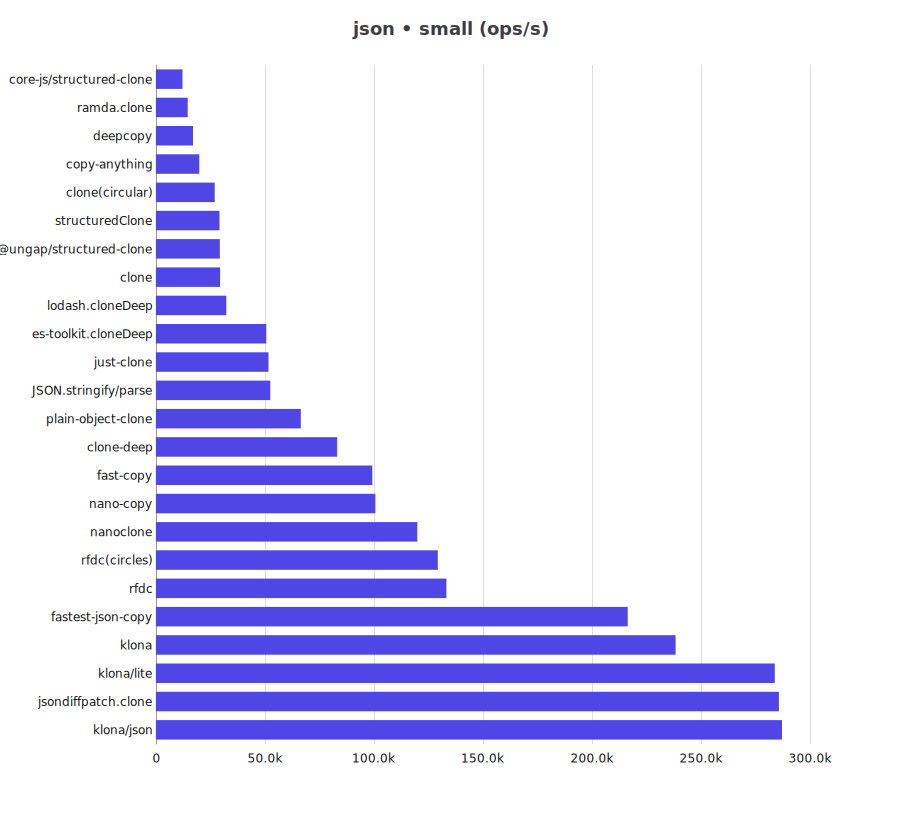
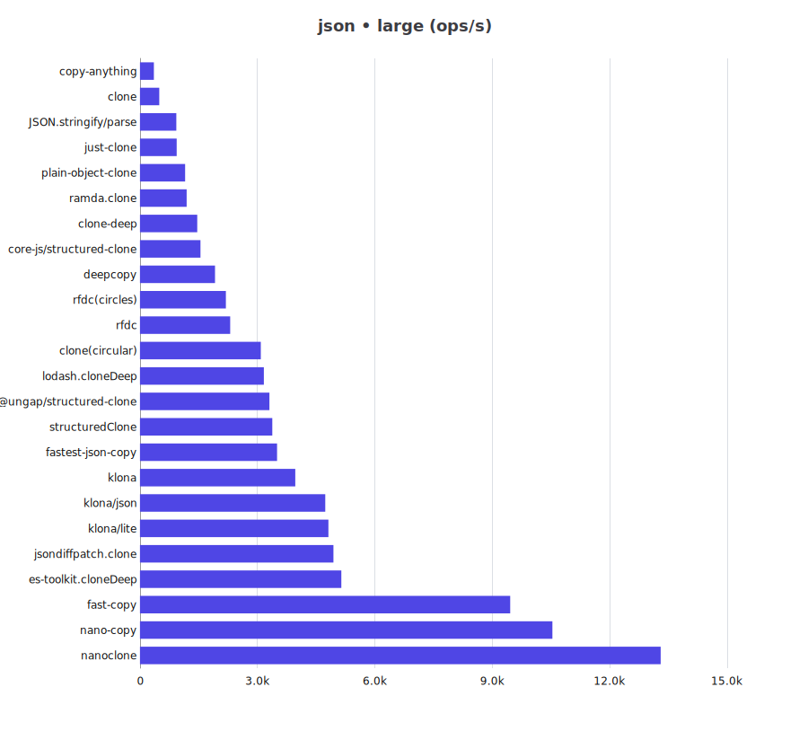
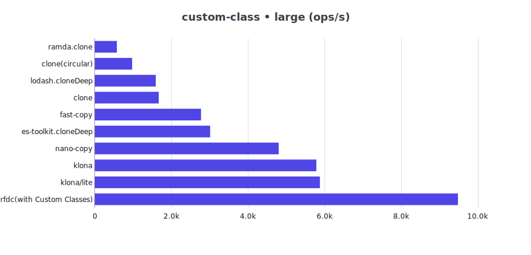
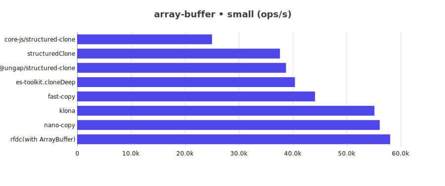
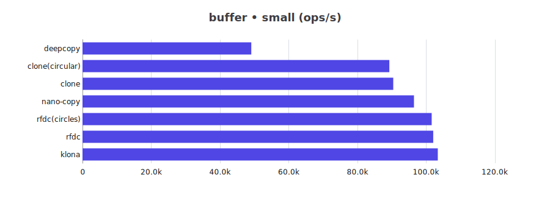
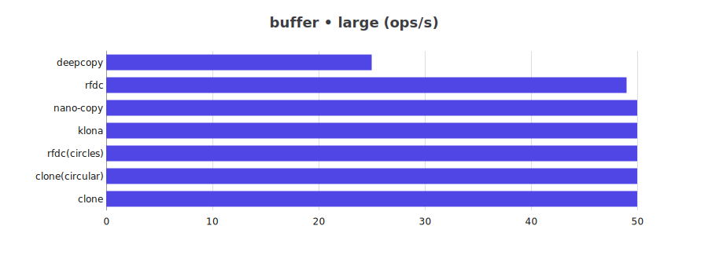
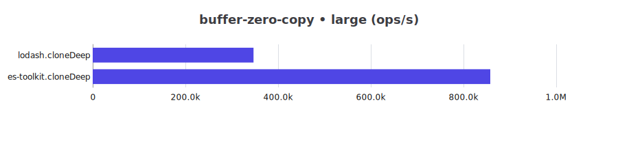

# JS Deep Clone Benchmark

This is a benchmark for JS deep clone libraries.

## Clone Support Matrix

| Library | json | json-circular | regexp | date | custom-class | array-buffer | buffer | map-set |
| -- | -- | -- | -- | -- | -- | -- | -- | -- |
| @ungap/structured-clone | ✅ | ✅ | ✅ | ✅ | ❌ | ✅ | ❌ | ✅ |
| clone | ✅ | ✅ | ✅ | ✅ | ✅ | ❌ | ✅ | ✅ |
| clone-deep | ✅ | ❌ | ✅ | ✅ | ❌ | ❌ | ❌ | ❌ |
| copy-anything | ✅ | ❌ | ❌ | ❌ | ❌ | ❌ | ❌ | ❌ |
| core-js/structured-clone | ✅ | ✅ | ✅ | ✅ | ❌ | ✅ | ❌ | ✅ |
| deepcopy | ✅ | ✅ | ✅ | ✅ | ❌ | ❌ | ✅ | ✅ |
| es-toolkit.cloneDeep | ✅ | ✅ | ✅ | ✅ | ✅ | ✅ | ❌ | ✅ |
| fast-copy | ✅ | ✅ | ✅ | ✅ | ✅ | ✅ | ❌ | ✅ |
| fastest-json-copy | ✅ | ❌ | ❌ | ❌ | ❌ | ❌ | ❌ | ❌ |
| JSON.stringify/parse | ✅ | ❌ | ❌ | ❌ | ❌ | ❌ | ❌ | ❌ |
| just-clone | ✅ | ❌ | ✅ | ✅ | ❌ | ❌ | ❌ | ✅ |
| klona | ✅ | ❌ | ✅ | ✅ | ✅ | ✅ | ✅ | ✅ |
| klona/json | ✅ | ❌ | ❌ | ❌ | ❌ | ❌ | ❌ | ❌ |
| klona/lite | ✅ | ❌ | ✅ | ✅ | ✅ | ❌ | ❌ | ❌ |
| lodash.cloneDeep | ✅ | ✅ | ✅ | ✅ | ✅ | ❌ | ❌ | ✅ |
| nano-copy | ✅ | ✅ | ✅ | ✅ | ✅ | ✅ | ✅ | ✅ |
| nanoclone | ✅ | ✅ | ✅ | ✅ | ❌ | ❌ | ❌ | ✅ |
| plain-object-clone | ✅ | ❌ | ❌ | ❌ | ❌ | ❌ | ❌ | ❌ |
| ramda.clone | ✅ | ✅ | ✅ | ✅ | ✅ | ❌ | ❌ | ❌ |
| rfdc | ✅ | ✅ | ⚠️ | ✅ | ⚠️ | ⚠️ | ✅ | ✅ |
| structuredClone | ✅ | ✅ | ✅ | ✅ | ❌ | ✅ | ❌ | ✅ |

> ⚠️: need customize manually to support

## Benchmark Results

for Bun please refer to [Bun](README.bun.md)

cpu: 13th Gen Intel(R) Core(TM) i5-13400F

runtime: node 22.20.0 (x64-win32)

### json

| Library | small (ops/s) | large (ops/s) |
| -- | --: | --: |
| @ungap/structured-clone | 29,312 | 3,307 |
| clone | 29,460 | 494 |
| clone-deep | 83,135 | 1,463 |
| clone(circular) | 26,986 | 3,087 |
| copy-anything | 19,903 | 355 |
| core-js/structured-clone | 12,208 | 1,545 |
| deepcopy | 17,029 | 1,918 |
| es-toolkit.cloneDeep | 50,637 | 5,144 |
| fast-copy | 99,275 | 9,457 |
| fastest-json-copy | 216,378 | 3,502 |
| JSON.stringify/parse | 52,462 | 929 |
| jsondiffpatch.clone | 285,734 | 4,943 |
| just-clone | 51,625 | 939 |
| klona | 238,360 | 3,967 |
| klona/json | 287,152 | 4,734 |
| klona/lite | 283,859 | 4,813 |
| lodash.cloneDeep | 32,285 | 3,164 |
| nano-copy | 100,693 | 10,536 |
| nanoclone | 119,913 | 13,300 |
| plain-object-clone | 66,441 | 1,153 |
| ramda.clone | 14,590 | 1,192 |
| rfdc | 133,247 | 2,304 |
| rfdc(circles) | 129,297 | 2,194 |
| structuredClone | 29,169 | 3,381 |

### json-circular

| Library | small (ops/s) | large (ops/s) |
| -- | --: | --: |
| @ungap/structured-clone | 438,490 | 564 |
| clone(circular) | 620,022 | 237 |
| core-js/structured-clone | 275,513 | 226 |
| deepcopy | 560,637 | 326 |
| es-toolkit.cloneDeep | 1,430,347 | 1,081 |
| fast-copy | 2,353,221 | 1,436 |
| lodash.cloneDeep | 972,842 | 640 |
| nano-copy | 2,478,243 | 1,772 |
| nanoclone | 3,422,417 | 2,116 |
| ramda.clone | 408,518 | 119 |
| rfdc(circles) | 3,441,385 | 2,399 |
| structuredClone | 415,087 | 550 |

### regexp

| Library | small (ops/s) | large (ops/s) |
| -- | --: | --: |
| @ungap/structured-clone | 75,555 | 8,444 |
| clone | 78,873 | 1,097 |
| clone-deep | 122,602 | 1,782 |
| clone(circular) | 75,769 | 7,299 |
| core-js/structured-clone | 42,820 | 4,818 |
| deepcopy | 54,858 | 5,936 |
| es-toolkit.cloneDeep | 130,238 | 13,475 |
| fast-copy | 140,436 | 13,638 |
| jsondiffpatch.clone | 94,581 | 1,417 |
| just-clone | 169,300 | 2,631 |
| klona | 301,731 | 4,322 |
| klona/lite | 343,675 | 4,736 |
| lodash.cloneDeep | 38,617 | 3,224 |
| nano-copy | 147,311 | 15,433 |
| nanoclone | 198,506 | 18,033 |
| ramda.clone | 53,574 | 5,078 |
| rfdc(with RegExp) | 250,891 | 3,804 |
| structuredClone | 71,766 | 8,168 |

### date

| Library | small (ops/s) | large (ops/s) |
| -- | --: | --: |
| @ungap/structured-clone | 36,599 | 11,147 |
| clone | 37,360 | 728 |
| clone-deep | 68,405 | 1,222 |
| clone(circular) | 32,728 | 4,498 |
| core-js/structured-clone | 12,138 | 1,722 |
| deepcopy | 26,273 | 5,409 |
| es-toolkit.cloneDeep | 63,292 | 17,500 |
| fast-copy | 67,518 | 12,068 |
| jsondiffpatch.clone | 230,733 | 4,468 |
| just-clone | 105,842 | 1,846 |
| klona | 130,718 | 2,356 |
| klona/lite | 130,407 | 2,303 |
| lodash.cloneDeep | 28,803 | 4,539 |
| nano-copy | 87,548 | 15,088 |
| nanoclone | 120,705 | 21,824 |
| ramda.clone | 25,138 | 3,990 |
| rfdc | 176,400 | 3,079 |
| rfdc(circles) | 156,087 | 2,900 |
| structuredClone | 38,138 | 10,208 |

### custom-class

| Library | small (ops/s) | large (ops/s) |
| -- | --: | --: |
| clone | 541,654 | 1,670 |
| clone(circular) | 482,279 | 974 |
| es-toolkit.cloneDeep | 1,072,097 | 3,012 |
| fast-copy | 868,905 | 2,773 |
| klona | 1,679,164 | 5,784 |
| klona/lite | 1,740,660 | 5,876 |
| lodash.cloneDeep | 624,076 | 1,593 |
| nano-copy | 1,502,130 | 4,802 |
| ramda.clone | 328,617 | 577 |
| rfdc(with Custom Classes) | 2,936,911 | 9,479 |

### array-buffer

| Library | small (ops/s) | large (ops/s) |
| -- | --: | --: |
| @ungap/structured-clone | 38,762 | 14 |
| core-js/structured-clone | 25,030 | 44 |
| es-toolkit.cloneDeep | 40,418 | 25 |
| fast-copy | 44,144 | 46 |
| klona | 55,171 | 47 |
| nano-copy | 56,146 | 47 |
| rfdc(with ArrayBuffer) | 58,089 | 46 |
| structuredClone | 37,642 | 13 |

### buffer

| Library | small (ops/s) | large (ops/s) |
| -- | --: | --: |
| clone | 90,397 | 50 |
| clone(circular) | 89,266 | 50 |
| deepcopy | 49,097 | 25 |
| klona | 103,362 | 50 |
| nano-copy | 96,430 | 50 |
| rfdc | 102,027 | 49 |
| rfdc(circles) | 101,590 | 50 |

### buffer-zero-copy

| Library | small (ops/s) | large (ops/s) |
| -- | --: | --: |
| es-toolkit.cloneDeep | 889,679 | 857,746 |
| lodash.cloneDeep | 352,431 | 346,917 |

### map-set

| Library | small (ops/s) | large (ops/s) |
| -- | --: | --: |
| @ungap/structured-clone | 88,417 | 8,754 |
| clone | 153,932 | 14,079 |
| clone(circular) | 140,049 | 12,517 |
| core-js/structured-clone | 36,804 | 3,872 |
| deepcopy | 86,693 | 7,773 |
| es-toolkit.cloneDeep | 248,444 | 23,737 |
| fast-copy | 255,951 | 21,599 |
| just-clone | 204,118 | 22,795 |
| klona | 384,277 | 32,251 |
| lodash.cloneDeep | 61,423 | 4,890 |
| nano-copy | 142,068 | 13,916 |
| nanoclone | 393,120 | 32,678 |
| rfdc | 131,267 | 17,891 |
| rfdc(circles) | 139,807 | 16,828 |
| structuredClone | 89,007 | 9,115 |

